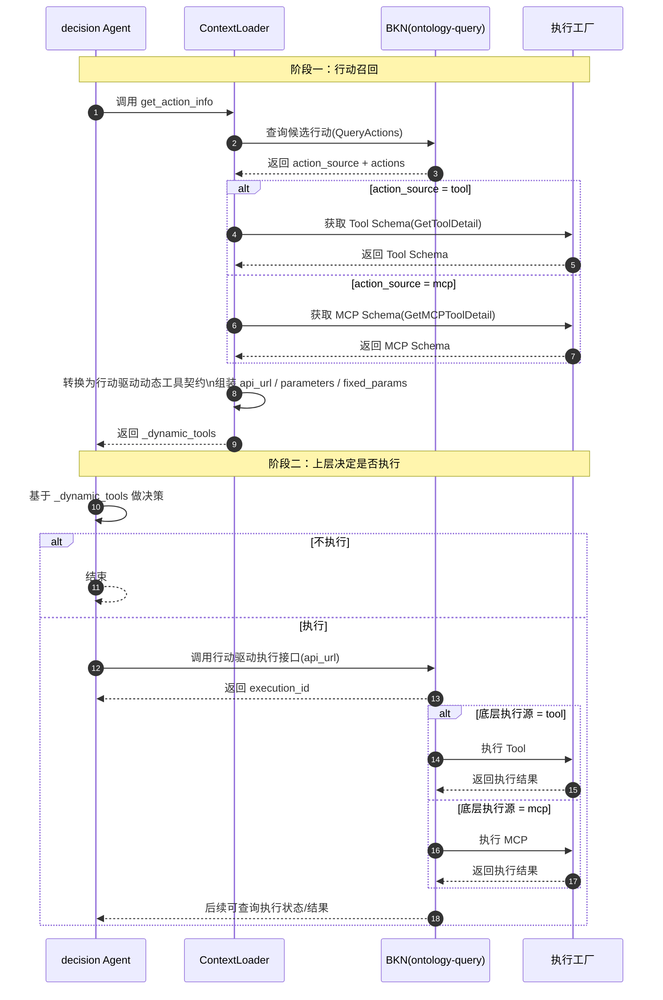

# 🏗️ Design Doc: ContextLoader 行动工具适配 BKN 行动驱动

> 状态: Draft  
> 负责人: @criller  
> Reviewers: 待确认  
> 关联 PRD: ../prd/issue-304-contextloader-bkn-action-driver-standard-prd.md  

---

# 📌 1. 概述（Overview）

## 1.1 背景

- 当前现状：
  - `context-loader/agent-retrieval` 的 `get_action_info` 在召回行动后，会基于 `action_source.type` 分别返回执行工厂工具 proxy 或 MCP proxy 的动态工具。
  - `tool` 类型当前将底层 OpenAPI Schema 转换为 `header/path/query/body` 四层结构，并使用同样的四层结构构造 `fixed_params`。
  - `mcp` 类型当前直接暴露 MCP 输入 Schema，并将行动实例化参数以扁平 map 形式放入 `fixed_params`。

- 存在问题：
  - `api_url` 仍直接暴露底层执行源入口，上层调用方需要感知 tool/MCP 差异，无法统一走行动驱动执行链路。
  - 动态工具当前表达的是“直接调用底层工具”的契约，而行动驱动真实需要的是“提交行动执行任务”的契约。
  - `tool` 类型当前暴露的 `header/path/query/body` 四层结构与行动驱动请求结构不一致，切换到行动驱动后无法直接复用。
  - `fixed_params` 当前承载的是底层执行参数，而非行动驱动请求默认值，改造后会与新的 `api_url` 语义错位。
  - 当前“获取 schema”和“转换 schema”的职责混在同一条链路描述中，容易在实现阶段误把下游取数流程当成主要改造对象。

- 业务 / 技术背景：
  - BKN `ontology-query` 已提供统一行动执行内部接口 `POST /api/ontology-query/in/v1/knowledge-networks/{kn_id}/action-types/{at_id}/execute`。
  - 该接口的请求体固定为 `dynamic_params`、`_instance_identities`、`trigger_type` 等字段组合；其中 `_instance_identities` 为可选字段，不传时行动驱动会按行动条件扫描对象。
  - 本次改造目标不是在 `get_action_info` 阶段执行行动，而是让其只负责召回，并返回与行动驱动匹配的动态工具契约，由上层调用方决定是否发起执行。

---

## 1.2 目标

- 将 `get_action_info` 返回的 `_dynamic_tools.api_url` 统一切换为 BKN 行动驱动内部执行接口，不再暴露执行工厂工具 proxy 或 MCP proxy。
- 将 `_dynamic_tools.parameters` 的顶层结构改造成行动驱动请求结构，最外层统一包含 `dynamic_params` 与 `_instance_identities`。
- 将 `_dynamic_tools.fixed_params` 的语义从“底层执行参数”改造成“行动驱动请求默认值”，默认携带当前召回实例和已实例化固定参数。
- 保持 `get_action_info` 对外请求方式与返回字段骨架兼容，使已有调用方可在不变更召回入口的前提下切换到行动驱动执行链路。
- 保持 `QueryActions`、`GetToolDetail`、`GetMCPToolDetail` 等 schema 获取链路基本不变，将主要改造收敛在 schema adaptation 与动态工具组装层。

---

## 1.3 非目标（Out of Scope）

- 不改造 `get_action_info` 的对外请求参数。
- 不修改 BKN 行动驱动服务自身的执行逻辑、调度逻辑和执行结果模型。
- 不在本期扩展 `get_action_info` 以外的其他 ContextLoader 工具。
- 不在本期重构 MCP 协议本身。

---

## 1.4 术语说明（Optional）

| 术语 | 说明 |
|------|------|
| ContextLoader | `context-loader/agent-retrieval` 服务，对外提供知识检索与行动召回能力 |
| 动态工具 | `get_action_info` 返回的 `_dynamic_tools`，供上层调用方继续消费 |
| 行动驱动 | BKN `ontology-query` 提供的统一行动执行接口与调度能力 |
| 底层执行源 | 行动真正落到的执行目标，当前包括 tool 与 MCP |
| `dynamic_params` | 行动驱动请求中的动态入参，由调用方按需填写 |
| `_instance_identities` | 行动驱动请求中的目标实例列表，本期要求作为可填参数暴露 |

---

# 🏗️ 2. 整体设计（HLD）

> 本章节关注系统“怎么搭建”，不涉及具体实现细节

---

## 🌍 2.1 系统上下文（C4 - Level 1）

### 参与者
- 用户：Agent 开发者、Agent 编排调用方
- 外部系统：BKN `ontology-query`
- 第三方服务：执行工厂工具服务、MCP 服务，由行动驱动在内部继续适配

### 系统关系

    Agent / 编排调用方 → ContextLoader(get_action_info) → Ontology Query(QueryActions)
    Agent / 编排调用方 → ContextLoader 返回的动态工具 → Ontology Query(Action Execute)
    Ontology Query(Action Execute) → Tool Proxy / MCP Proxy

---

## 🧱 2.2 容器架构（C4 - Level 2）

| 容器 | 技术栈 | 职责 |
|------|--------|------|
| ContextLoader REST/MCP Adapter | Go + Gin + MCP Adapter | 接收 `get_action_info` 请求并返回动态工具 |
| ContextLoader Action Recall Logic | Go | 查询行动、构造行动驱动契约、组装 `_dynamic_tools` |
| Ontology Query Action Query API | Go + Gin | 提供行动查询能力，返回候选行动与行动源 |
| Ontology Query Action Execute API | Go + Gin | 提供统一行动驱动执行入口，异步返回 `execution_id` |
| Operator Integration / MCP Proxy | Go | 被行动驱动内部调用，执行真正的 tool / MCP |

---

### 容器交互

    get_action_info 调用方
      → ContextLoader Handler
      → ContextLoader knactionrecall Service
      → Ontology Query QueryActions
      → ContextLoader 组装行动驱动动态工具
      → 调用方拿到 api_url / parameters / fixed_params
      → 调用方按需调用 Ontology Query Execute API

---

## 🧩 2.3 组件设计（C4 - Level 3）

### ContextLoader `knactionrecall` 组件

| 组件 | 职责 |
|------|------|
| `KnActionRecallHandler` | 绑定 header/query/body，调用 `GetActionInfo` |
| `GetActionInfo` 主流程 | 查询行动、过滤候选、根据行动源加载详情并组装动态工具 |
| Schema Acquisition Layer | 复用现有 `QueryActions`、`GetToolDetail`、`GetMCPToolDetail` 获取候选行动与底层 schema |
| Action Driver URL Builder | 统一生成行动驱动内部执行接口地址 |
| Tool Schema Mapper | 将 tool OpenAPI Schema 去除 `header/path/query/body` 外壳后转换为 `dynamic_params` 子结构 |
| MCP Schema Wrapper | 复用 MCP schema 解析能力，并包装为顶层行动驱动请求结构 |
| Fixed Params Mapper | 将实例化参数与当前实例映射为行动驱动请求默认值 |

---

## 🔄 2.4 数据流（Data Flow）

### 核心泳道交互图



### 主流程

    调用方请求 get_action_info
      → ContextLoader 调用 QueryActions
      → 取得 action_source 与 actions[0]
      → 加载 tool detail 或 MCP detail
      → 复用现有 schema 获取结果
      → 将底层 schema 映射为 dynamic_params
      → 包装顶层 _instance_identities + dynamic_params
      → 构造行动驱动 api_url
      → 返回 _dynamic_tools

### 子流程（可选）

    tool action
      → 解析 parameters/path/query/header + request_body
      → 去掉 header/path/query/body 外壳
      → 合并为 dynamic_params.properties

    mcp action
      → 解析 input_schema
      → 直接作为 dynamic_params 的 schema
      → 包装顶层请求结构

---

## ⚖️ 2.5 关键设计决策（Design Decisions）

| 决策 | 说明 |
|------|------|
| `api_url` 统一返回行动驱动内部接口 | 由 `get_action_info` 隐藏底层执行源，调用方只面向统一执行入口 |
| `_instance_identities` 暴露为可填参数 | 满足上层调用方控制执行对象集合的诉求，同时 `fixed_params` 默认填入当前召回实例 |
| `parameters` 顶层统一为行动驱动结构 | 最外层固定为 `dynamic_params` 与 `_instance_identities`，避免继续暴露底层 tool/MCP 请求壳层 |
| `fixed_params` 改为行动驱动默认值 | 旧的 `header/path/query/body` 语义废弃，改成行动驱动请求体默认内容 |
| `branch`、`trigger_type` 本期不作为主要用户输入暴露 | `branch` 使用行动驱动默认 `main`，`trigger_type` 使用默认 `manual`；后续有业务需要再扩展 |
| 保持 `get_action_info` 只负责召回 | 是否执行、何时执行、执行多少实例由上层调用方决定，ContextLoader 不在召回阶段发起执行 |
| schema 获取链路尽量不动 | 复用现有 `QueryActions`、`GetToolDetail`、`GetMCPToolDetail` 取数逻辑，降低改造范围 |
| schema 转换作为主要改造点 | 重点改造 `tool` 去壳转换与行动驱动顶层包装，不重写下游取数流程 |

---

## 🚀 2.6 部署架构（Deployment）

- 部署环境：K8s
- 拓扑结构：ContextLoader 与 `ontology-query` 通过集群内部服务名通信，`get_action_info` 返回内部执行接口地址
- 扩展策略：水平扩展；本次改造不新增独立服务与存储

---

## 🔐 2.7 非功能设计

### 性能
- `get_action_info` 仍维持“查询行动 + 获取详情 + 组装结果”的同步链路，不新增实际执行动作
- 主要新增开销为 schema 包装与参数映射，预期对整体延迟影响较小

### 可用性
- 当行动驱动可用时，必须返回可直接提交执行任务的动态工具
- 当行动驱动契约不可用或无法构造动态工具时，按既有错误模式返回明确失败信息

### 安全
- `api_url` 返回内部接口地址，默认面向平台内调用方
- 调用方后续执行时所需账号身份、业务域等上下文由行动驱动接口继续校验和透传

### 可观测性
- tracing：沿用 ContextLoader 现有请求链路埋点
- logging：记录 action source 类型、schema 映射结果摘要、动态工具组装结果摘要
- metrics：可选新增行动驱动动态工具生成成功率、schema 转换失败率

---

# 🔧 3. 详细设计（LLD）

> 本章节关注“如何实现”，开发可直接参考

---

## 🌐 3.1 API 设计

### `get_action_info` 返回契约调整

**Endpoint:** `POST /api/agent-retrieval/in/v1/kn/get_action_info`

**Request:**

```json
{
  "kn_id": "kn_xxx",
  "at_id": "at_xxx",
  "_instance_identity": {
    "id": "obj_001"
  }
}
```

**Response:**

```json
{
  "headers": {
    "x-account-id": "account_xxx"
  },
  "_dynamic_tools": [
    {
      "name": "restart_pod",
      "description": "通过行动驱动提交重启 Pod 行动",
      "parameters": {
        "type": "object",
        "properties": {
          "dynamic_params": {
            "type": "object",
            "description": "行动执行动态参数",
            "properties": {
              "pod_name": {
                "type": "string"
              },
              "namespace": {
                "type": "string"
              }
            },
            "required": [
              "pod_name"
            ]
          },
          "_instance_identities": {
            "type": "array",
            "description": "目标实例列表；为空时由行动驱动按条件扫描",
            "items": {
              "type": "object"
            }
          }
        }
      },
      "api_url": "http://ontology-query:13018/api/ontology-query/in/v1/knowledge-networks/kn_xxx/action-types/at_xxx/execute",
      "original_schema": {
      },
      "fixed_params": {
        "dynamic_params": {
          "namespace": "default"
        },
        "_instance_identities": [
          {
            "id": "obj_001"
          }
        ]
      },
      "api_call_strategy": "kn_action_recall"
    }
  ]
}
```

---

### BKN 行动驱动内部接口

**Endpoint:** `POST /api/ontology-query/in/v1/knowledge-networks/{kn_id}/action-types/{at_id}/execute`

**Request:**

```json
{
  "dynamic_params": {
    "pod_name": "test-pod"
  },
  "_instance_identities": [
    {
      "id": "obj_001"
    }
  ]
}
```

**Response:**

```json
{
  "execution_id": "cqq2g8h4d2fg00fvm8dg",
  "status": "pending",
  "message": "Action execution started",
  "created_at": 1704067200000
}
```

---

## 🗂️ 3.2 数据模型

### `KnDynamicTool` 新语义

| 字段 | 类型 | 说明 |
|------|------|------|
| `name` | string | 仍表示行动对应工具名 |
| `description` | string | 语义改为“提交行动执行任务”的说明 |
| `parameters` | object schema | 顶层固定为 `dynamic_params` + `_instance_identities` |
| `api_url` | string | 固定指向行动驱动内部执行接口 |
| `original_schema` | object | 保留底层 tool/MCP schema，便于排查和兼容 |
| `fixed_params` | object | 改为行动驱动请求默认值，不再表示底层执行参数 |
| `api_call_strategy` | string | 继续使用 `kn_action_recall`，保持字段兼容 |

---

### `ActionDriverDynamicToolParameters`

| 字段 | 类型 | 说明 |
|------|------|------|
| `dynamic_params` | object | 底层 tool/MCP 动态参数，经映射后供调用方填写 |
| `_instance_identities` | array<object> | 目标实例列表；本期要求暴露为可填参数 |

---

### `ActionDriverFixedParams`

| 字段 | 类型 | 说明 |
|------|------|------|
| `dynamic_params` | object | 行动实例化后已确定的固定参数 |
| `_instance_identities` | array<object> | 默认填入当前 `get_action_info` 的 `_instance_identity` |

---

## 💾 3.3 存储设计

- 存储类型：无新增存储
- 数据分布：沿用现有 ContextLoader 内存组装方式
- 索引设计：无

---

## 🔁 3.4 核心流程（详细）

### `get_action_info` 组装行动驱动动态工具

1. 接收 `kn_id`、`at_id`、`_instance_identity`。
2. 调用 `QueryActions`，查询当前对象实例与行动类型对应的候选行动。
3. 校验 `action_source` 是否为当前支持的 `tool` 或 `mcp`。
4. 取当前候选行动 `actions[0]`，读取 `firstAction.Parameters` 作为已实例化参数。
5. 如果 `type=tool`，沿用现有 `GetToolDetail` 获取 tool OpenAPI Schema。
6. 如果 `type=mcp`，沿用现有 `GetMCPToolDetail` 获取 MCP 输入 Schema。
7. 在不改动 schema 获取来源的前提下，将底层 schema 转换为 `dynamic_params` 的子 schema。
8. 统一包装顶层 `parameters = { dynamic_params, _instance_identities }`。
9. 统一构造 `fixed_params = { dynamic_params: firstAction.Parameters, _instance_identities: [req.InstanceIdentity] }`。
10. 构造行动驱动内部执行接口 `api_url`。
11. 返回 `_dynamic_tools`。

---

### `tool` 类型 schema 映射流程

1. 解析 OpenAPI `parameters` 中的 path/query/header 参数。
2. 解析 `request_body` 下的 JSON body schema。
3. 去除当前对 `header/path/query/body` 的顶层包装。
4. 将所有参数合并到 `dynamic_params.properties`。
5. 将原先按 location 归类的 required 信息合并为 `dynamic_params.required`。
6. 若同名字段来自不同 location，按“行动参数名在行动类型维度唯一”的约束处理；若不满足该约束，返回构造失败并记录错误日志。

---

### `mcp` 类型 schema 映射流程

1. 解析 MCP `input_schema`。
2. 保持其 object schema 结构，作为 `dynamic_params` 的 schema。
3. 在其外层统一包装 `_instance_identities` 字段。
4. `firstAction.Parameters` 直接写入 `fixed_params.dynamic_params`。

---

## 🧠 3.5 关键逻辑设计

### schema 获取与 schema 转换的职责边界
- schema 获取：
  - 继续沿用当前 `QueryActions`、`GetToolDetail`、`GetMCPToolDetail` 的调用方式
  - 本期不引入新的下游接口，也不重构候选行动和详情的取数顺序
- schema 转换：
  - 作为本次主要改造点
  - 将当前“底层执行源视角”的 schema 输出改造成“行动驱动请求视角”的 schema 输出
  - `tool` 类型改动较大，`mcp` 类型主要复用解析能力并补顶层包装

### `api_url` 生成逻辑
- 统一返回 `http://{ontology-query-host}:{port}/api/ontology-query/in/v1/knowledge-networks/{kn_id}/action-types/{at_id}/execute`
- `kn_id` 与 `at_id` 取自当前 `get_action_info` 请求
- 不再拼接 `box_id`、`tool_id`、`mcp_id`、`tool_name`

### `parameters` 映射规则
- 顶层固定为 object，包含：
  - `dynamic_params`
  - `_instance_identities`
- `_instance_identities`：
  - 类型为 `array<object>`
  - 不设为必填
  - 描述中明确“不传则行动驱动按条件扫描”
- `dynamic_params`：
  - `tool` 类型时由 OpenAPI Schema 去壳后生成；保留现有 `$ref` 解析、properties 展开等底层能力，但不再产出 `header/path/query/body` 外层结构
  - `mcp` 类型时复用 `input_schema` 解析结果；不直接作为最终 `parameters` 返回，而是挂入顶层 `dynamic_params`
- `branch` 与 `trigger_type` 本期不放入 `parameters` 顶层

### `fixed_params` 映射规则
- 统一改造成行动驱动请求默认值：
  - `fixed_params.dynamic_params = firstAction.Parameters`
  - `fixed_params._instance_identities = []map[string]interface{}{req.InstanceIdentity}`
- 不再返回 `KnFixedParams{header,path,query,body}`
- 不再返回 MCP 扁平 map 作为最终 `fixed_params`

### schema adaptation 改造范围
- 保留：
  - `QueryActions`
  - `GetToolDetail`
  - `GetMCPToolDetail`
  - 现有 schema 解析中的 `$ref` 展开、递归裁剪、属性定义构建等基础能力
- 改造：
  - `tool` 类型的 `convertSchemaToFunctionCall` 输出形态
  - `tool` 类型 `mapFixedParams` 的输出语义
  - MCP 最终 `parameters` 与 `fixed_params` 的顶层包装
  - `GetActionInfo` 中 `api_url`、`parameters`、`fixed_params` 的组装逻辑

### `_instance_identities` 暴露策略
- 本期将 `_instance_identities` 作为可填参数对外暴露
- 同时在 `fixed_params` 中默认带入当前实例，供调用方直接复用
- 上层调用方可覆盖该字段以变更执行对象集合
- 若上层清空该字段，行动驱动将按行动条件扫描实例；该行为需要在文档与描述中明确提示

### 兼容策略
- `get_action_info` 的请求方式保持不变
- `_dynamic_tools` 字段骨架保持不变
- `api_call_strategy` 保持 `kn_action_recall`
- `fixed_params` 内部结构变化属于语义升级，调用方需按行动驱动契约消费

---

## ❗ 3.6 错误处理

- `QueryActions` 失败：沿用当前错误返回
- `action_source` 不支持：返回 400
- tool/MCP 详情查询失败：返回下游错误
- schema 转换失败：返回 500，并在日志中记录行动源类型、行动标识与失败原因
- 若 schema 获取成功但 adaptation 失败：按 schema 转换失败处理，避免误导为下游取数故障
- tool schema 字段同名冲突：返回构造失败，错误码沿用内部错误模型，具体错误码定义为 `待确认`
- 行动驱动内部接口地址无法构造：返回 500

---

## ⚙️ 3.7 配置设计

| 配置项 | 默认值 | 说明 |
|--------|--------|------|
| `ontology_query.private_protocol` | `http` | 行动驱动内部接口协议 |
| `ontology_query.private_host` | 待确认 | `ontology-query` 内部服务地址 |
| `ontology_query.private_port` | 待确认 | `ontology-query` 内部服务端口 |
| `action_driver.default_branch` | `main` | 本期 `branch` 默认值 |
| `action_driver.default_trigger_type` | `manual` | 本期 `trigger_type` 默认值 |

---

## 📊 3.8 可观测性实现

- tracing：
  - `GetActionInfo` 主流程继续保留现有 span
  - 新增 schema 映射子步骤 span，可区分 `tool` 和 `mcp`

- metrics：
  - `get_action_info_action_driver_tool_generated_total`
  - `get_action_info_action_driver_schema_convert_failed_total`
  - `get_action_info_action_driver_candidate_filtered_total`

- logging：
  - 记录字段：`kn_id`、`at_id`、`action_source.type`、`dynamic_tool_name`
  - 记录 schema 映射摘要，不打印敏感参数值
  - `_instance_identities` 仅记录数量与关键标识，不打印完整实例数据

---

# ⚠️ 4. 风险与权衡（Risks & Trade-offs）

| 风险 | 影响 | 解决方案 |
|------|------|----------|
| `tool` 类型去掉 `header/path/query/body` 后可能出现同名字段冲突 | `dynamic_params` 无法唯一表达参数来源 | 明确以“行动参数名唯一”为接入前提，不满足时拒绝生成动态工具并记录错误 |
| `_instance_identities` 作为可填参数暴露后，上层可改变执行范围 | 单实例召回结果可能被用于批量执行 | 在描述与文档中明确该行为；`fixed_params` 默认填充当前实例，降低误用概率 |
| `fixed_params` 语义升级后，旧调用方可能仍按底层执行参数理解 | 联调阶段出现入参拼装错误 | 在设计文档、发布说明和示例中明确新语义，并提供样例 |
| 行动驱动接口文档与真实代码不一致 | 设计与实现偏差 | 以 `ontology-query` 代码实现为准，并在联调前补齐接口核对 |

---

# 🧪 5. 测试策略（Testing Strategy）

- 单元测试：
  - `QueryActions`、`GetToolDetail`、`GetMCPToolDetail` 调用链保持不变
  - `tool` schema 去壳后映射为 `dynamic_params`
  - `mcp` schema 包装为顶层行动驱动结构
  - `fixed_params` 正确映射为 `{dynamic_params, _instance_identities}`
  - `api_url` 正确指向行动驱动内部接口
  - `_instance_identities` 作为可填参数出现在 `parameters` 顶层且非必填

- 集成测试：
  - `get_action_info` 在 `tool` 类型下返回行动驱动动态工具
  - `get_action_info` 在 `mcp` 类型下返回行动驱动动态工具
  - 使用返回结果发起一次行动驱动执行，校验返回 `202` 与 `execution_id`

- 压测：
  - 对比改造前后 `get_action_info` 响应延迟，确认 schema 包装带来的额外开销可接受

---

# 📅 6. 发布与回滚（Release Plan）

### 发布步骤
1. 合入 ContextLoader 动态工具契约改造代码与测试。
2. 在测试环境联调 `ontology-query` 内部执行接口。
3. 发布灰度版本，验证 `tool` 与 `mcp` 两类行动均可通过行动驱动返回动态工具。
4. 补充发布说明，明确 `fixed_params` 与 `parameters` 的新语义。

### 回滚方案
- 若行动驱动动态工具生成失败率显著升高，回滚到旧版 `get_action_info` 返回逻辑。
- 若仅存在少量行动类型映射问题，可通过灰度开关或版本回滚恢复旧链路，具体开关实现为 `待确认`。

---

# 🔗 7. 附录（Appendix）

## 相关文档
- PRD: ../prd/issue-304-contextloader-bkn-action-driver-standard-prd.md
- BKN 行动执行接口文档: ../../../docs/api/bkn/ontology-query-ai/ontology-query.yaml

## 参考资料
- `context-loader/agent-retrieval/server/logics/knactionrecall/get_action_info.go`
- `context-loader/agent-retrieval/server/logics/knactionrecall/schema_converter.go`
- `bkn/ontology-query/server/driveradapters/action_execution_handler.go`
- `bkn/ontology-query/server/interfaces/action_execution.go`

---
