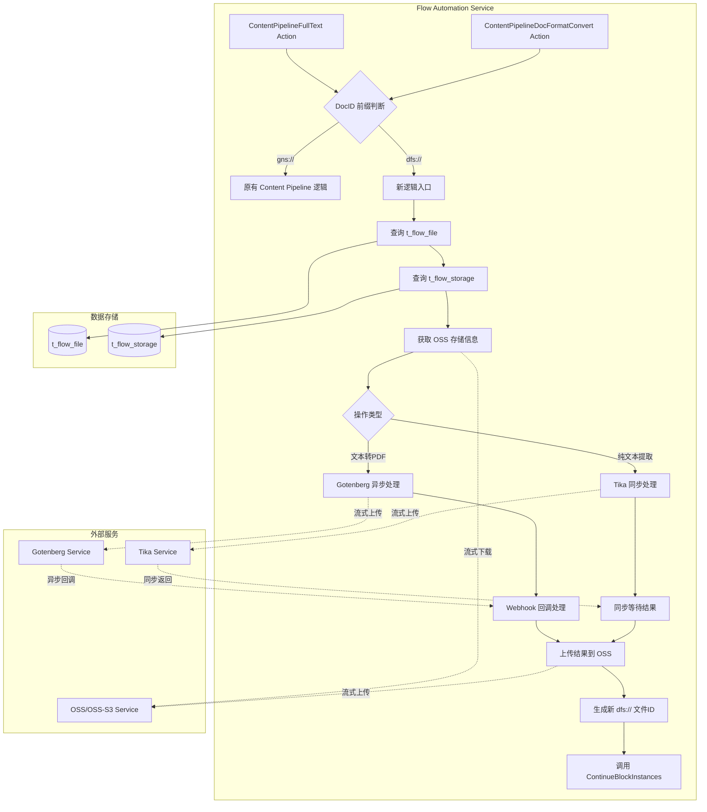
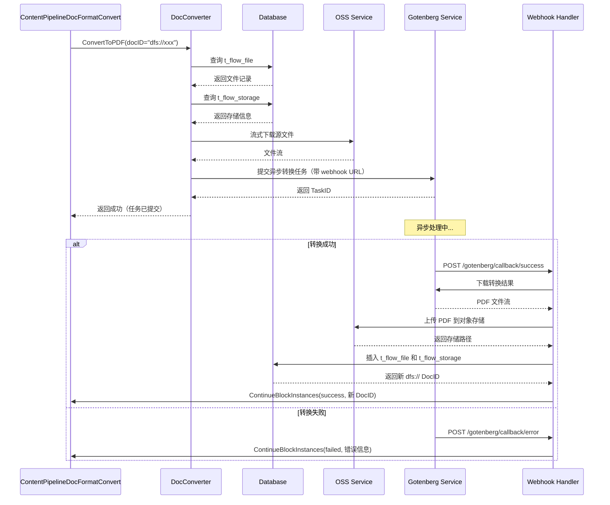
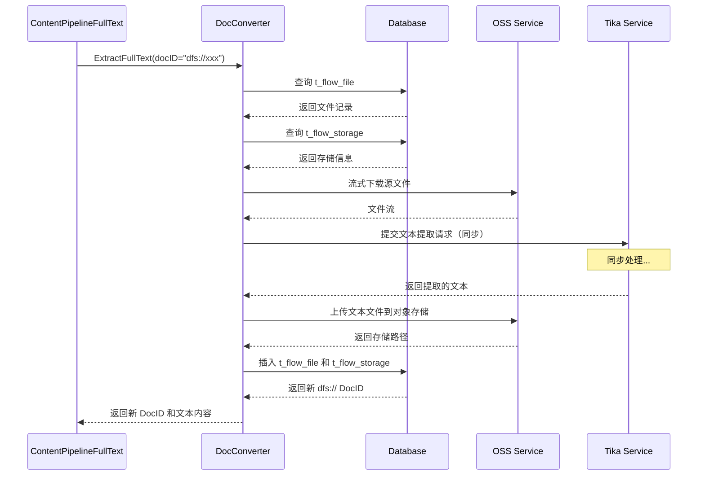
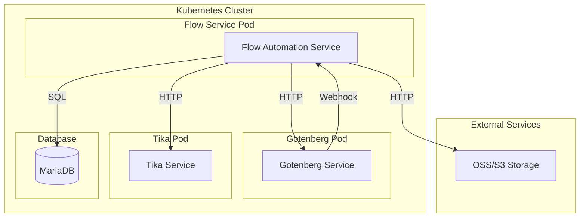

# 基于 Gotenberg 和 Tika 的文档转换功能设计文档

## 1. 文档信息

- **功能名称**: gotenberg-text-to-pdf&tika-extracts-plain-text
- **文档版本**: v1.0
- **创建日期**: 2026/3/20
- **文档状态**: 设计阶段

## 2. 项目概述

### 2.1 背景

Kweaver-Core项目中去除了对内容数据湖的依赖，导致当前系统使用 Content Pipeline 服务进行文档转换和文本提取，针对 `gns://` 前缀的 DocID 实现逻辑已不适用。此次功能旨在基于新的 `dfs://` 前缀的 DocID 实现基于开源服务的文档转换功能，使用 Gotenberg 进行文档转 PDF 转换，使用 Tika 进行纯文本提取代替原有实现。

### 2.2 目标

1. 实现基于 Gotenberg 的文本转 PDF 功能，支持异步任务处理
2. 实现基于 Tika 的纯文本提取功能，支持同步处理
3. 通过 DocID 前缀（`gns://` vs `dfs://`）区分新旧逻辑
4. 新逻辑不依赖 TaskCache 机制，简化实现
5. 支持流式文件上传下载，优化内存使用

### 2.3 核心价值

- 降低对第三方服务依赖，使用开源方案
- 支持更大文件处理（最大 1GB）
- 提供更灵活的文档转换能力
- 简化缓存逻辑，提高系统可维护性

## 3. 需求分析

### 3.1 功能需求

#### FR1: 文本转 PDF 功能
- 支持 `dfs://` 前缀的 DocID
- 从数据库查询文件存储信息
- 流式下载源文件并上传至 Gotenberg
- 异步处理，通过 webhook 回调
- 转换结果上传至对象存储
- 生成新的 `dfs://` 格式文件 ID
- 继续执行阻塞任务

#### FR2: 纯文本提取功能
- 支持 `dfs://` 前缀的 DocID
- 从数据库查询文件存储信息
- 流式下载源文件并上传至 Tika
- 同步等待处理完成
- 提取结果上传至对象存储
- 生成新的 `dfs://` 格式文件 ID
- 继续执行当前任务

#### FR3: 逻辑隔离
- 通过 DocID 前缀区分新旧逻辑
- `gns://` 保持原有 Content Pipeline 逻辑
- `dfs://` 使用新的 Gotenberg/Tika 逻辑
- 新逻辑不使用 TaskCache

### 3.2 非功能需求

#### NFR1: 性能要求
- 支持最大 1GB 文件处理
- 流式传输避免内存溢出
- Gotenberg 支持合适的并发任务数
- 异步处理避免长时间阻塞

#### NFR2: 可靠性要求
<!-- - 文件下载失败重试机制 -->
- 转换失败错误处理
- Webhook 回调失败处理
- 数据库事务一致性

#### NFR3: 可维护性要求
- 代码结构清晰，易于扩展
- 日志记录完整
- 错误信息明确
- 配置参数可调整

## 4. 系统架构设计

### 4.1 整体架构




### 4.2 模块设计

#### 4.2.1 核心模块划分

```
drivenadapters/
├── gotenberg.go         # Gotenberg 服务适配器
├── tika.go              # Tika 服务适配器
└── tika_plain_text.go   # Tika 纯文本提取适配器

pkg/dependency/
├── dependency.go        # 文档转换对外统一依赖接口
└── doc_converter.go     # dfs 文档转换实现（PDF/纯文本）

driveradapters/
└── callback/
    └── rest_handler.go  # Gotenberg success/error 回调接口

pkg/actions/
└── content_pipeline.go  # 内容处理 action 对接 DocConverter
```

#### 4.2.2 Gotenberg 适配器模块

**职责**：
- 封装 Gotenberg API 调用
- 支持流式文件上传
- 处理异步任务提交
- 管理 success/error 两类 webhook 回调 URL

**核心接口**：
```go
type PDFConverter interface {
    ConvertToPDF(ctx context.Context, req *GotenbergConvertRequest) error
}

type GotenbergConvertRequest struct {
    FileName        string
    File            io.Reader
    WebhookURL      string
    WebhookErrorURL string
    WebhookHeaders  map[string]string
}
```

#### 4.2.3 Tika 适配器模块

**职责**：
- 封装 Tika API 调用
- 支持流式文件上传
- 同步等待文本提取结果

**核心接口**：
```go
type TikaClient interface {
    // 提取纯文本（同步）
    ExtractText(ctx context.Context, req *ExtractRequest) (*ExtractResponse, error)
}

type ExtractRequest struct {
    FileReader io.Reader
    FileName   string
}

type ExtractResponse struct {
    Text       string
    ContentType string
}
```

#### 4.2.4 文档转换统一接口

**职责**：
- 提供统一的文档转换入口
- 根据 DocID 前缀路由到不同实现
- 处理文件查询和存储逻辑

**核心接口**：
```go
type DocConverter interface {
    // 文本转 PDF
    ConvertToPDF(ctx context.Context, docID string) error

    // 提取纯文本
    ExtractFullText(ctx context.Context, docID string) (string, error)
}
```


### 4.3 数据流设计

#### 4.3.1 文本转 PDF 流程（异步）



#### 4.3.2 纯文本提取流程（同步）




### 4.4 错误处理策略

#### 4.4.1 错误分类

| 错误类型 | 处理策略 | 用户反馈 |
|---------|---------|---------|
| DocID 格式错误 | 立即返回错误 | "无效的文档 ID 格式" |
| 文件不存在 | 立即返回错误 | "文件不存在或已删除" |
| OSS 下载失败 | 失败后返回错误 | "文件下载失败，请稍后重试" |
| Gotenberg 服务不可用 | 返回错误，记录日志 | "文档转换服务暂时不可用" |
| Tika 服务不可用 | 返回错误，记录日志 | "文本提取服务暂时不可用" |
| 转换超时 | 返回错误 | "文档转换超时，请检查文件大小" |

## 5. API/接口设计

### 5.1 Gotenberg API

#### 5.1.1 文本转 PDF（异步）

**请求**：
```http
POST /forms/chromium/convert/url
Content-Type: multipart/form-data

--boundary
Content-Disposition: form-data; name="files"; filename="document.txt"
Content-Type: text/plain

[文件内容]
--boundary
Content-Disposition: form-data; name="webhookUrl"

http://flow-service:8080/api/automation/v1/gotenberg/callback/success
--boundary
Content-Disposition: form-data; name="webhookErrorUrl"

http://flow-service:8080/api/automation/v1/gotenberg/callback/error
--boundary
Content-Disposition: form-data; name="webhookExtraHttpHeaders"

{"X-Task-ID": "task-123"}
--boundary--
```

**响应**：
```http
HTTP/1.1 204 No Content
```

**Webhook 成功回调**：
```http
POST /api/automation/v1/gotenberg/callback/success
Content-Type: application/pdf
X-Task-ID: task-123
X-Source-Doc-ID: dfs://611893070035711420
X-Result-File-Name: converted.pdf

[PDF 二进制流]
```

**Webhook 失败回调**：
```http
POST /api/automation/v1/gotenberg/callback/error
Content-Type: application/json
X-Task-ID: task-123

{
  "message": "gotenberg convert failed"
}
```


### 5.2 Tika API

#### 5.2.1 提取纯文本（同步）

**请求**：
```http
PUT /tika
Content-Type: application/octet-stream

[文件二进制内容]
```

**响应**：
```http
HTTP/1.1 200 OK
Content-Type: text/plain; charset=UTF-8

[提取的文本内容]
```

### 5.3 内部 Webhook API

#### 5.3.1 Gotenberg 成功回调接口

**端点**：`POST /api/automation/v1/gotenberg/callback/success`

**请求头**：
```
Content-Type: application/pdf
X-Task-ID: <任务ID>
X-Source-Doc-ID: <原始文档ID>
X-Result-File-Name: <结果文件名>
```

**请求体**：PDF 二进制流

**响应**：
```json
{
  "code": 0,
  "message": "accepted"
}
```

**处理语义**：
- 调用 `HandleGotenbergCallback` 保存转换后的 PDF
- 创建新的 `dfs://` 文件记录
- 调用 `ContinueBlockInstances(..., success)` 续跑阻塞任务

#### 5.3.2 Gotenberg 失败回调接口

**端点**：`POST /api/automation/v1/gotenberg/callback/error`

**请求头**：
```
Content-Type: application/json | text/plain
X-Task-ID: <任务ID>
```

**请求体**：
- JSON 时优先读取 `message` 或 `error` 字段
- 非 JSON 时直接读取原始文本作为失败原因

**响应**：
```json
{
  "code": 0,
  "message": "accepted"
}
```

**处理语义**：
- 不保存 PDF 文件
- 直接调用 `ContinueBlockInstances(..., failed)` 续跑阻塞任务
- 返回错误码 `gotenberg_callback_failed`

## 6. 数据库设计

### 6.1 表结构

#### 6.1.1 t_flow_file（文件元数据表）

#### 6.1.2 t_flow_storage（存储信息表）

现有表结构，无需修改。

### 6.2 数据流转

**文本转 PDF 数据流**：
1. 查询源文件：`SELECT * FROM t_flow_file WHERE f_id = 'dfs://xxx'`
2. 查询存储信息：`SELECT * FROM t_flow_storage WHERE file_id = ?`
3. 插入新文件记录：
```sql
INSERT INTO t_flow_file (doc_id, file_name, file_size, source_doc_id, convert_type, convert_status)
VALUES ('dfs://new-xxx', 'converted.pdf', 12345, 'dfs://xxx', 'text-to-pdf', 'success')
```
4. 插入存储记录：
```sql
INSERT INTO t_flow_storage (file_id, storage_type, bucket, object_key)
VALUES (?, 'oss', 'flow-files', 'converted/xxx.pdf')
```


## 7. 部署架构

### 7.1 服务部署



### 7.2 资源配置

本节提供两种部署方案：方案一使用 Docker Compose 直接部署服务，适合开发和测试环境；方案二使用 Helm Chart 部署到 Kubernetes，适合生产环境。

#### 7.2.1 方案一：Docker Compose 部署

**docker-compose.yml**：

```yaml
version: '3.8'

services:
  # Gotenberg 服务
  gotenberg:
    image: gotenberg/gotenberg:7
    container_name: gotenberg
    ports:
      - "3000:3000"
    environment:
      - CHROMIUM_MAX_QUEUE_SIZE=10
      - CHROMIUM_AUTO_START=true
      - GOTENBERG_API_TIMEOUT=300s
    deploy:
      resources:
        limits:
          memory: 2G
          cpus: '2.0'
        reservations:
          memory: 512M
          cpus: '0.5'
    restart: unless-stopped
    networks:
      - flow-network
    healthcheck:
      test: ["CMD", "curl", "-f", "http://localhost:3000/health"]
      interval: 30s
      timeout: 10s
      retries: 3

  # Tika 服务
  tika:
    image: apache/tika:latest
    container_name: tika
    ports:
      - "9998:9998"
    environment:
      - TIKA_CONFIG=/config/tika-config.xml
    deploy:
      resources:
        limits:
          memory: 4G
          cpus: '2.0'
        reservations:
          memory: 1G
          cpus: '0.5'
    restart: unless-stopped
    networks:
      - flow-network
    healthcheck:
      test: ["CMD", "curl", "-f", "http://localhost:9998/tika"]
      interval: 30s
      timeout: 10s
      retries: 3
    volumes:
      - ./tika-config.xml:/config/tika-config.xml:ro

  # Flow Automation Service（示例）
  flow-service:
    image: flow-automation:latest
    container_name: flow-service
    ports:
      - "8080:8080"
    environment:
      - GOTENBERG_ENDPOINT=http://gotenberg:3000
      - TIKA_ENDPOINT=http://tika:9998
      - WEBHOOK_BASE_URL=http://flow-service:8080
      - DB_HOST=mariadb
      - DB_PORT=3306
      - DB_NAME=flow_db
      - DB_USER=flow_user
      - DB_PASSWORD=flow_password
    depends_on:
      - gotenberg
      - tika
      - mariadb
    restart: unless-stopped
    networks:
      - flow-network

  # MariaDB 数据库
  mariadb:
    image: mariadb:10.11
    container_name: mariadb
    ports:
      - "3306:3306"
    environment:
      - MYSQL_ROOT_PASSWORD=root_password
      - MYSQL_DATABASE=flow_db
      - MYSQL_USER=flow_user
      - MYSQL_PASSWORD=flow_password
    volumes:
      - mariadb-data:/var/lib/mysql
    restart: unless-stopped
    networks:
      - flow-network

networks:
  flow-network:
    driver: bridge

volumes:
  mariadb-data:
```

**启动命令**：
```bash
# 启动所有服务
docker-compose up -d

# 查看服务状态
docker-compose ps

# 查看日志
docker-compose logs -f gotenberg
docker-compose logs -f tika

# 停止服务
docker-compose down

# 停止并删除数据卷
docker-compose down -v
```

**资源说明**：
- Gotenberg：512MB-2GB 内存，0.5-2 CPU 核心
- Tika：1GB-4GB 内存，0.5-2 CPU 核心
- 适合单机部署，开发测试环境

#### 7.2.2 方案二：Kubernetes Helm Chart 部署

**目录结构**：
```
helm-chart/
├── Chart.yaml
├── values.yaml
├── templates/
│   ├── gotenberg-deployment.yaml
│   ├── gotenberg-service.yaml
│   ├── tika-deployment.yaml
│   ├── tika-service.yaml
│   ├── configmap.yaml
│   └── ingress.yaml
```

**Chart.yaml**：
```yaml
apiVersion: v2
name: doc-converter
description: Document conversion services using Gotenberg and Tika
version: 1.0.0
appVersion: "1.0"
```

**values.yaml**：
```yaml
# Gotenberg 配置
gotenberg:
  enabled: true
  replicaCount: 2
  image:
    repository: gotenberg/gotenberg
    tag: "7"
    pullPolicy: IfNotPresent

  resources:
    requests:
      memory: "512Mi"
      cpu: "500m"
    limits:
      memory: "2Gi"
      cpu: "2000m"

  env:
    - name: CHROMIUM_MAX_QUEUE_SIZE
      value: "10"
    - name: CHROMIUM_AUTO_START
      value: "true"
    - name: GOTENBERG_API_TIMEOUT
      value: "300s"

  service:
    type: ClusterIP
    port: 3000

  livenessProbe:
    httpGet:
      path: /health
      port: 3000
    initialDelaySeconds: 30
    periodSeconds: 10
    timeoutSeconds: 5
    failureThreshold: 3

  readinessProbe:
    httpGet:
      path: /health
      port: 3000
    initialDelaySeconds: 10
    periodSeconds: 5
    timeoutSeconds: 3
    failureThreshold: 3

# Tika 配置
tika:
  enabled: true
  replicaCount: 2
  image:
    repository: apache/tika
    tag: "latest"
    pullPolicy: IfNotPresent

  resources:
    requests:
      memory: "1Gi"
      cpu: "500m"
    limits:
      memory: "4Gi"
      cpu: "2000m"

  env:
    - name: TIKA_CONFIG
      value: "/config/tika-config.xml"

  service:
    type: ClusterIP
    port: 9998

  livenessProbe:
    httpGet:
      path: /tika
      port: 9998
    initialDelaySeconds: 30
    periodSeconds: 10
    timeoutSeconds: 5
    failureThreshold: 3

  readinessProbe:
    httpGet:
      path: /tika
      port: 9998
    initialDelaySeconds: 10
    periodSeconds: 5
    timeoutSeconds: 3
    failureThreshold: 3

# 全局配置
global:
  namespace: flow-automation
  storageClass: standard

# Ingress 配置（可选）
ingress:
  enabled: false
  className: nginx
  annotations:
    cert-manager.io/cluster-issuer: letsencrypt-prod
  hosts:
    - host: gotenberg.example.com
      paths:
        - path: /
          pathType: Prefix
          service: gotenberg
    - host: tika.example.com
      paths:
        - path: /
          pathType: Prefix
          service: tika
  tls:
    - secretName: doc-converter-tls
      hosts:
        - gotenberg.example.com
        - tika.example.com
```

**templates/gotenberg-deployment.yaml**：
```yaml
{{- if .Values.gotenberg.enabled }}
apiVersion: apps/v1
kind: Deployment
metadata:
  name: {{ include "doc-converter.fullname" . }}-gotenberg
  namespace: {{ .Values.global.namespace }}
  labels:
    app: gotenberg
    {{- include "doc-converter.labels" . | nindent 4 }}
spec:
  replicas: {{ .Values.gotenberg.replicaCount }}
  selector:
    matchLabels:
      app: gotenberg
  template:
    metadata:
      labels:
        app: gotenberg
    spec:
      containers:
      - name: gotenberg
        image: "{{ .Values.gotenberg.image.repository }}:{{ .Values.gotenberg.image.tag }}"
        imagePullPolicy: {{ .Values.gotenberg.image.pullPolicy }}
        ports:
        - containerPort: 3000
          name: http
        env:
        {{- toYaml .Values.gotenberg.env | nindent 8 }}
        resources:
          {{- toYaml .Values.gotenberg.resources | nindent 10 }}
        livenessProbe:
          {{- toYaml .Values.gotenberg.livenessProbe | nindent 10 }}
        readinessProbe:
          {{- toYaml .Values.gotenberg.readinessProbe | nindent 10 }}
{{- end }}
```

**templates/gotenberg-service.yaml**：
```yaml
{{- if .Values.gotenberg.enabled }}
apiVersion: v1
kind: Service
metadata:
  name: gotenberg
  namespace: {{ .Values.global.namespace }}
  labels:
    app: gotenberg
    {{- include "doc-converter.labels" . | nindent 4 }}
spec:
  type: {{ .Values.gotenberg.service.type }}
  ports:
  - port: {{ .Values.gotenberg.service.port }}
    targetPort: 3000
    protocol: TCP
    name: http
  selector:
    app: gotenberg
{{- end }}
```

**templates/tika-deployment.yaml**：
```yaml
{{- if .Values.tika.enabled }}
apiVersion: apps/v1
kind: Deployment
metadata:
  name: {{ include "doc-converter.fullname" . }}-tika
  namespace: {{ .Values.global.namespace }}
  labels:
    app: tika
    {{- include "doc-converter.labels" . | nindent 4 }}
spec:
  replicas: {{ .Values.tika.replicaCount }}
  selector:
    matchLabels:
      app: tika
  template:
    metadata:
      labels:
        app: tika
    spec:
      containers:
      - name: tika
        image: "{{ .Values.tika.image.repository }}:{{ .Values.tika.image.tag }}"
        imagePullPolicy: {{ .Values.tika.image.pullPolicy }}
        ports:
        - containerPort: 9998
          name: http
        env:
        {{- toYaml .Values.tika.env | nindent 8 }}
        resources:
          {{- toYaml .Values.tika.resources | nindent 10 }}
        livenessProbe:
          {{- toYaml .Values.tika.livenessProbe | nindent 10 }}
        readinessProbe:
          {{- toYaml .Values.tika.readinessProbe | nindent 10 }}
{{- end }}
```

**templates/tika-service.yaml**：
```yaml
{{- if .Values.tika.enabled }}
apiVersion: v1
kind: Service
metadata:
  name: tika
  namespace: {{ .Values.global.namespace }}
  labels:
    app: tika
    {{- include "doc-converter.labels" . | nindent 4 }}
spec:
  type: {{ .Values.tika.service.type }}
  ports:
  - port: {{ .Values.tika.service.port }}
    targetPort: 9998
    protocol: TCP
    name: http
  selector:
    app: tika
{{- end }}
```

**部署命令**：
```bash
# 创建命名空间
kubectl create namespace flow-automation

# 安装 Helm Chart
helm install doc-converter ./helm-chart \
  --namespace flow-automation \
  --values ./helm-chart/values.yaml

# 查看部署状态
kubectl get pods -n flow-automation
kubectl get svc -n flow-automation

# 升级部署
helm upgrade doc-converter ./helm-chart \
  --namespace flow-automation \
  --values ./helm-chart/values.yaml

# 卸载
helm uninstall doc-converter -n flow-automation

# 查看日志
kubectl logs -f deployment/doc-converter-gotenberg -n flow-automation
kubectl logs -f deployment/doc-converter-tika -n flow-automation
```

**资源说明**：
- Gotenberg：2 副本，每副本 512MB-2GB 内存，0.5-2 CPU
- Tika：2 副本，每副本 1GB-4GB 内存，0.5-2 CPU
- 支持水平扩展，适合生产环境
- 包含健康检查和就绪探测
- 支持 Ingress 暴露服务（可选）

### 7.3 网络配置

**Service 定义**：
```yaml
# Gotenberg Service
apiVersion: v1
kind: Service
metadata:
  name: gotenberg
spec:
  selector:
    app: gotenberg
  ports:
    - port: 3000
      targetPort: 3000

# Tika Service
apiVersion: v1
kind: Service
metadata:
  name: tika
spec:
  selector:
    app: tika
  ports:
    - port: 9998
      targetPort: 9998
```

### 7.4 并发控制策略

为了保证 Gotenberg 和 Tika 服务的稳定性和资源利用率，需要在应用层实现并发控制机制，防止过多的并发请求导致服务过载。

#### 7.4.1 Gotenberg 并发控制

**待优化问题**：
- Gotenberg 基于 Chromium 进行文档转换，每个转换任务消耗大量内存和 CPU
- 过多并发任务会导致服务响应变慢甚至崩溃
- 需要限制同时处理的任务数量

#### 7.4.2 Tika 并发控制

**待优化问题**：
- Tika 处理大文件时消耗大量内存
- 同步处理模式下，过多并发会导致响应变慢
- 需要限制同时处理的请求数量

## 8. 测试策略

### 8.1 单元测试

#### 8.1.1 Gotenberg 适配器测试

**测试用例**：
- 正常文本转 PDF 请求
- 文件流读取错误处理
- Webhook URL 格式验证
- 超时处理
- 服务不可用处理

**Mock 对象**：
- HTTP Client
- File Reader
- Context

#### 8.1.2 Tika 适配器测试

**测试用例**：
- 正常文本提取请求
- 不同文件格式处理
- 大文件流式处理
- 超时处理
- 服务不可用处理

#### 8.1.3 DocConverter 测试

**测试用例**：
- DocID 前缀路由逻辑
- 数据库查询错误处理
- OSS 下载重试机制
- 文件上传错误处理
- 事务回滚测试

### 8.2 集成测试

#### 8.2.1 端到端测试场景

**场景 1：文本转 PDF（异步）**
1. 准备测试文件并上传到 OSS
2. 插入测试数据到 t_flow_file 和 t_flow_storage
3. 调用 ConvertToPDF API
4. 验证任务提交成功
5. 模拟 Gotenberg success/error 回调
6. 验证新文件记录创建
7. 验证 ContinueBlockInstances 被调用

**场景 2：纯文本提取（同步）**
1. 准备测试文件并上传到 OSS
2. 插入测试数据到数据库
3. 调用 ExtractFullText API
4. 验证返回的文本内容正确
5. 验证新文件记录创建

**场景 3：错误处理**
- 文件不存在
- OSS 下载失败
- Gotenberg 服务不可用
- Tika 服务不可用
- Webhook success/error 回调失败

### 8.3 性能测试

#### 8.3.1 测试指标

| 指标 | 目标值 | 测试方法 |
|------|--------|---------|
| 小文件转换时间（<10MB） | <30s | 压力测试 |
| 大文件转换时间（100MB-1GB） | <5min | 单次测试 |
| 并发处理能力 | 10 个任务/分钟 | 并发测试 |
| 内存使用 | <2GB | 监控测试 |
| 错误率 | <1% | 稳定性测试 |

#### 8.3.2 测试场景

**压力测试**：
- 并发提交 50 个转换任务
- 监控服务响应时间和资源使用
- 验证所有任务最终完成

**稳定性测试**：
- 持续运行 24 小时
- 每分钟提交 5 个任务
- 监控内存泄漏和错误率

## 9. 附录

### 9.1 相关文档

- [Gotenberg 官方文档](https://gotenberg.dev/)
- [Apache Tika 官方文档](https://tika.apache.org/)

### 9.2 术语表

| 术语 | 说明 |
|------|------|
| DocID | 文档唯一标识符，格式为 `dfs://xxx` 或 `gns://xxx` |
| Gotenberg | 开源文档转换服务，支持多种格式转 PDF |
| Tika | Apache 开源文本提取工具 |
| OSS | 对象存储服务（Object Storage Service） |
| Webhook | HTTP 回调机制，用于异步通知 |
| 流式传输 | 边读边写的数据传输方式，避免内存占用过大 |

### 9.3 变更历史

| 版本 | 日期 | 变更内容 |
|------|------|---------|
| v1.0 | 2026 | 初始版本 |

---
