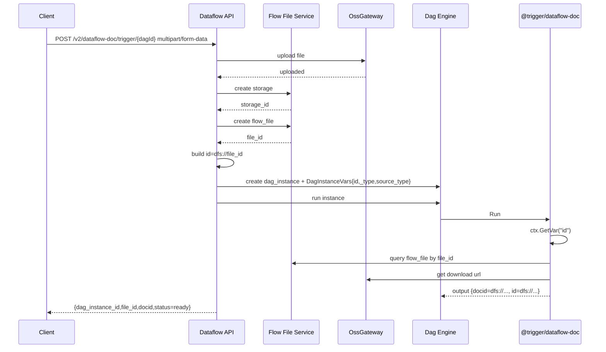
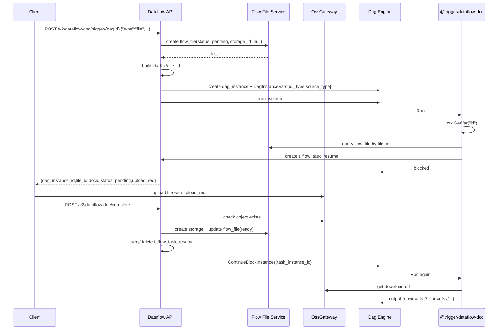
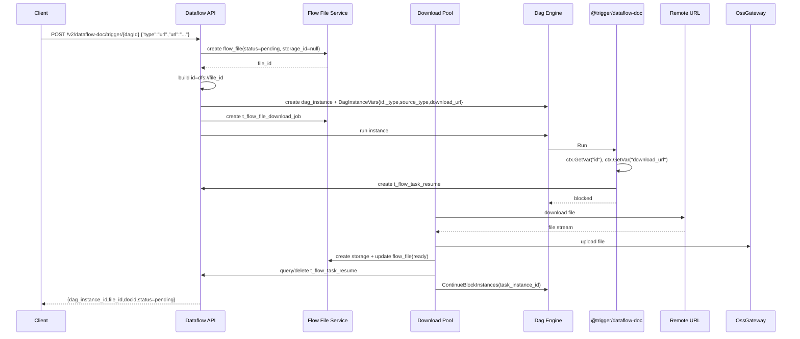

# 【Dataflow】非结构化数据处理支持直接触发

## 1. 背景与范围

Dataflow 早期的非结构化数据处理能力依赖内容数据湖文档库。内容数据湖下线后：

- 旧文档库触发链路不再继续演进，但代码暂时保留以兼容旧流程
- 上一版本新增的 S3 数据源属于实验性方案，本期不调整
- 本期目标是在 **不影响旧功能** 的前提下，补齐 Dataflow 自身的文件子系统，并基于该文件子系统为 `@trigger/dataflow-doc` 增加统一的内部文件协议与触发链路

本期仅覆盖：

- 表单直接上传文件触发
- 先触发、后上传文件触发(基于 `OssGateWay` 直接上传到对象存储)
- 基于 URL 下载文件触发
- 基于 `OssGateway` 的文件存储与元数据管理
- `DagInstanceVars` 中的文件来源记录与运行态透传
- `DataFlowDocTrigger` 的新输出字段与阻塞恢复(先触发、后上传文件)机制

本期明确不覆盖：

- 内容数据湖文档库能力恢复或重构
- 实验性 S3 数据源方案改造
- `ext_data`、`task_cache` 等其他基于 OssGateway 的既有存储场景

---

## 2. 目标

### 2.1 业务目标

- 支持通过接口直接提交非结构化文件处理任务
- 支持统一的内部文件协议，供 Dataflow 内部文件交换使用
- 支持文件与 `dag` / `dag_instance` 的关联，便于后续做预览、下载与权限控制
- 支持非表单上传场景下 `Blocked -> 上传完成 -> 继续执行`
- 支持把不同来源的文件统一收敛为 Dataflow 内部文件对象，而不是把来源差异持续暴露给后续节点

### 2.2 技术目标

- 引入统一文件协议 `dfs://<file_id>`
- 基于 `OssGateway` 存储文件，不引入新的存储后端语义
- 拆分存储对象表和业务文件表，避免存储生命周期与流程权限耦合
- 在 `DagInstanceVars` 中记录文件来源与触发参数，在 `flow_file` 中只保存 Dataflow 文件对象语义
- 在 `DataFlowDocTrigger` 中同时保留旧字段兼容，并将 `docid`、`id` 等文件标识统一输出为 `dfs://...`

---

## 3. 现状分析

### 3.1 OssGateway 已有能力

`drivenadapters/ossgateway.go` 当前已提供：

- `GetAvaildOSS`：获取当前可用 OSS 存储
- `UploadFile` / `SimpleUpload`：上传文件
- `DownloadFile` / `DownloadFile2Local`：下载文件
- `DeleteFile`：删除文件
- `GetDownloadURL`：获取下载链接
- `GetObjectMeta`：获取对象大小

OssGateway 的职责边界是：

- 负责与对象存储交互
- 不负责 Dataflow 业务文件实体
- 不负责权限
- 不负责 `dag` / `dag_instance` 关系
- 不负责阻塞恢复状态管理

因此，本期仍需在 Dataflow 内部补齐业务文件模型与数据库设计。

### 3.2 现有问题

- `@trigger/dataflow-doc` 目前缺少统一的内部文件协议
- Dataflow 当前缺少独立于内容数据湖的文件子系统，触发器只能直接消费旧文档库 `docid` 或实验性 S3 变量
- 非表单上传场景无法稳定表达“实例已创建但文件尚未上传完成”
- OssGateway 需要新增获取上传文件地址接口，用于先触发后上传场景
- 缺少面向 `dag_instance` 的文件绑定模型，无法支撑后续预览、下载和权限控制
- 如果把存储元信息和业务关系塞进同一张表，会导致后续生命周期、复用和授权边界混乱

### 3.3 当前代码链路现状

当前代码中与本需求直接相关的链路如下：

- `driveradapters/mgnt/rest_handler.go`
  - 现有 `/api/automation/v1/run-instance-with-doc/:dagId` 入口仅接受 `docid`
- `schema/base/run-with-doc.json`
  - 当前 schema 只有 `docid` 和 `data`
- `logics/mgnt/mgnt.go`
  - `RunInstanceWithDoc` 会校验旧文档库目录范围，并调用 `efast.GetDocMsg` 获取内容数据湖文件元数据
- `pkg/actions/trigger.go`
  - `@trigger/dataflow-doc` 当前仅支持两条链路：
    - 复用旧 `triggerManual` 的文档库文件语义
    - 读取实验性 S3 数据源注入的 `bucket/key` 变量
- `logics/mgnt/mgnt.go`
  - `ContinueBlockInstances` 已具备恢复阻塞任务实例的通用能力

因此，本期不是在旧 `run-with-doc` 上简单扩参，而是要在不破坏旧逻辑的前提下，引入一套新的 Dataflow 文件子系统，并让 `@trigger/dataflow-doc` 在新链路中只消费 `dfs://` 文件对象。

---

## 4. 核心设计

### 4.1 核心原则

- 存储抽象只认 `OssGateway`，不把 `s3://`、bucket/path 等外部存储语义带入 Dataflow 协议层
- `dfs://` 代表 Dataflow 内部文件对象，不代表物理文件地址
- 存储对象和业务文件拆表设计
- `dfs://` 基于业务文件表主键生成，而不是基于存储表主键生成
- `DataFlowDocTrigger` 只消费统一文件对象，不直接暴露存储实现差异
- 文件来源差异只存在于“文件进入系统之前”；一旦进入 Dataflow，后续节点、预览、下载、恢复逻辑只认 `flow_file + dfs://`
- 文件来源不落到 `t_flow_file` 结构中，创建实例时写入 `DagInstanceVars`

### 4.2 文件子系统职责

本期新增的 Dataflow 文件子系统负责：

- 为 Dataflow 创建统一的内部文件对象
- 管理 `flow_file -> flow_storage -> OssGateway` 的映射
- 为 `@trigger/dataflow-doc` 提供统一输入对象
- 为后续预览、下载、权限控制提供稳定资源标识
- 承担“先触发、后上传”场景下的阻塞恢复锚点

本期文件子系统不负责：

- 还原内容数据湖文档库模型
- 兼容外部系统的原始文件协议
- 替换实验性 S3 数据源链路
- 承担通用附件中心或跨业务文件中心职责

### 4.3 为什么拆成两张表

拆分后职责更清晰：

- `t_flow_storage`
  - 面向 `OssGateway`
  - 负责物理存储对象与存储生命周期
  - 可支持后续文件清理、复用、去重、失效处理

- `t_flow_file`
  - 面向 Dataflow 业务语义
  - 负责 `dag` / `dag_instance` 绑定、状态流转、权限和预览下载入口
  - 作为 `dfs://` 的资源实体

若合并为一张表，会产生以下问题：

- 物理存储对象和流程实例关系耦合
- 同一文件复用或后续转存场景会变得复杂
- `dfs://` 无法稳定代表业务文件对象
- 文件生命周期清理与实例权限边界混在一起

因此，本期采用双表方案。

---

## 5. 协议设计

### 5.1 DFS 协议

内部文件协议定义如下：

```text
dfs://<file_id>
```

示例：

```text
dfs://604851178156619196
```

### 5.2 协议绑定对象

`dfs://` 绑定 `t_flow_file.f_id`，不绑定 `t_flow_storage.f_id`。

原因：

- `t_flow_storage` 代表物理存储对象
- `t_flow_file` 代表 Dataflow 内部文件对象
- 前端预览、下载、权限判断、实例恢复都依赖 `flow_file` 语义

### 5.3 协议解析规则

解析 `dfs://<file_id>` 后：

1. 查询 `t_flow_file`
2. 校验 `dag_id` / `dag_instance_id` / 状态 / 操作人权限
3. 通过 `storage_id` 查询 `t_flow_storage`
4. 再通过 `oss_id + object_key` 访问 `OssGateway`

### 5.4 与 Trigger 输出的关系

在新链路中，`dfs://<file_id>` 通过 `docid` 字段对外暴露，作为 `@trigger/dataflow-doc` 输出里的统一文件标识。

兼容策略：

- 保留 `docid` 作为主文件标识，兼容旧前端节点配置和既有节点参数习惯
- 在新文件子系统链路下，`docid` 不再表示内容数据湖 `docid`
- 统一表示 Dataflow 内部文件对象标识 `dfs://<file_id>`
- 不新增独立 `dfs_uri` 输出字段，避免双协议并存

---

## 6. 数据库设计

### 6.1 `t_flow_storage`

用途：仅用于描述已经落到 `OssGateway` 中的物理对象。

建议字段：

```sql
CREATE TABLE IF NOT EXISTS `t_flow_storage` (
  `f_id` BIGINT UNSIGNED NOT NULL COMMENT '主键ID',
  `f_oss_id` VARCHAR(64) NOT NULL DEFAULT '' COMMENT 'OssGateway存储ID',
  `f_object_key` VARCHAR(512) NOT NULL DEFAULT '' COMMENT '对象存储key',
  `f_name` VARCHAR(256) NOT NULL DEFAULT '' COMMENT '原始文件名',
  `f_content_type` VARCHAR(128) NOT NULL DEFAULT '' COMMENT 'MIME类型',
  `f_size` BIGINT UNSIGNED NOT NULL DEFAULT 0 COMMENT '文件大小',
  `f_etag` VARCHAR(128) NOT NULL DEFAULT '' COMMENT '文件etag/hash',
  `f_status` TINYINT NOT NULL DEFAULT 1 COMMENT '状态 1正常 2待删除 3已删除',
  `f_created_at` BIGINT NOT NULL DEFAULT 0 COMMENT '创建时间',
  `f_updated_at` BIGINT NOT NULL DEFAULT 0 COMMENT '更新时间',
  `f_deleted_at` BIGINT NOT NULL DEFAULT 0 COMMENT '删除时间 0表示未删除',
  PRIMARY KEY (`f_id`),
  UNIQUE KEY `uk_flow_storage_oss_id_object_key` (`f_oss_id`, `f_object_key`),
  KEY `idx_flow_storage_status` (`f_status`),
  KEY `idx_flow_storage_created_at` (`f_created_at`)
) ENGINE=InnoDB COMMENT 'Dataflow存储文件表';
```

字段说明：

- `f_oss_id`
  - 来自 `OssGateway.GetAvaildOSS`
- `f_object_key`
  - Dataflow 内部约定的对象路径
- `f_status`
  - 仅描述底层对象生命周期，不承载下载、上传、阻塞等业务流程状态

关键约束：

- `t_flow_storage` 只在对象已经成功进入 `OssGateway` 后创建
- 对于 URL 下载中、等待用户上传中的文件，不预创建 `t_flow_storage`
- `t_flow_storage` 删除前必须再次确认不存在任何有效 `t_flow_file` 引用

不建议在该表放入：

- `dag_id`
- `dag_instance_id`
- 权限字段
- `dfs_uri`

这些都属于业务语义，不属于存储对象本身。

### 6.2 `t_flow_file`

用途：描述 Dataflow 内部文件对象，并承载 `dfs://` 协议。

建议字段：

```sql
CREATE TABLE IF NOT EXISTS `t_flow_file` (
  `f_id` BIGINT UNSIGNED NOT NULL COMMENT '主键ID，对应 dfs://<id>',
  `f_dag_id` VARCHAR(64) NOT NULL DEFAULT '' COMMENT '流程定义ID',
  `f_dag_instance_id` VARCHAR(64) NOT NULL DEFAULT '' COMMENT '流程实例ID',
  `f_storage_id` BIGINT UNSIGNED NOT NULL DEFAULT 0 COMMENT '存储文件ID，未落OSS时为空',
  `f_status` TINYINT NOT NULL DEFAULT 1 COMMENT '业务状态 1待就绪 2就绪 3失效 4已过期',
  `f_name` VARCHAR(256) NOT NULL DEFAULT '' COMMENT '文件名',
  `f_expires_at` BIGINT NOT NULL DEFAULT 0 COMMENT '过期时间 0表示不过期',
  `f_created_at` BIGINT NOT NULL DEFAULT 0 COMMENT '创建时间',
  `f_updated_at` BIGINT NOT NULL DEFAULT 0 COMMENT '更新时间',
  PRIMARY KEY (`f_id`),
  KEY `idx_flow_file_dag_id` (`f_dag_id`),
  KEY `idx_flow_file_dag_instance_id` (`f_dag_instance_id`),
  KEY `idx_flow_file_storage_id` (`f_storage_id`),
  KEY `idx_flow_file_status` (`f_status`),
  KEY `idx_flow_file_expires_at` (`f_expires_at`)
) ENGINE=InnoDB COMMENT 'Dataflow业务文件表';
```

字段说明：

- `f_id`
  - 业务文件主键，直接作为 `dfs://` 标识
- `f_dag_instance_id`
  - 用于实例级权限、恢复执行和前端文件展示
- `f_storage_id`
  - 允许为空
  - 当文件尚未完成下载或上传时，不绑定物理对象
- `f_status`
  - 仅描述该文件对象当前是否可被 trigger 消费
- `f_expires_at`
  - 用于支持自动过期清理

### 6.3 状态拆分

文件对象状态与物理对象状态分离：

- `t_flow_storage.f_status`
  - `1 normal`
  - `2 pending_delete`
  - `3 deleted`

- `t_flow_file.f_status`
  - `1 pending`
  - `2 ready`
  - `3 invalid`
  - `4 expired`

说明：

- `pending`
  - 文件对象已创建，但物理文件尚未 ready
  - 包括系统下载中、用户等待上传、上传完成回调未处理完等场景
- `ready`
  - 文件可被 `@trigger/dataflow-doc` 正常消费
- `invalid`
  - 下载失败、上传失败、校验失败等不可恢复或当前实例不再使用的状态
- `expired`
  - 过期失效，等待或已经进入清理流程

这样可以避免把“节点 blocked”“物理对象删除中”“文件对象不可用”混在一个字段里。

### 6.4 `t_flow_file_download_job`

用途：仅用于管理 URL 文件下载任务，由服务内部下载线程池消费。

```sql
CREATE TABLE IF NOT EXISTS `t_flow_file_download_job` (
  `f_id` BIGINT UNSIGNED NOT NULL COMMENT '主键ID',
  `f_file_id` BIGINT UNSIGNED NOT NULL COMMENT '关联flow_file ID',
  `f_status` TINYINT NOT NULL DEFAULT 1 COMMENT '任务状态 1待执行 2执行中 3成功 4失败 5取消',
  `f_retry_count` INT NOT NULL DEFAULT 0 COMMENT '已重试次数',
  `f_max_retry` INT NOT NULL DEFAULT 3 COMMENT '最大重试次数',
  `f_next_retry_at` BIGINT NOT NULL DEFAULT 0 COMMENT '下次重试时间',
  `f_error_code` VARCHAR(64) NOT NULL DEFAULT '' COMMENT '错误码',
  `f_error_message` VARCHAR(1024) NOT NULL DEFAULT '' COMMENT '错误信息',
  `f_download_url` VARCHAR(2048) NOT NULL DEFAULT '' COMMENT '源文件URL',
  `f_started_at` BIGINT NOT NULL DEFAULT 0 COMMENT '开始时间',
  `f_finished_at` BIGINT NOT NULL DEFAULT 0 COMMENT '结束时间',
  `f_created_at` BIGINT NOT NULL DEFAULT 0 COMMENT '创建时间',
  `f_updated_at` BIGINT NOT NULL DEFAULT 0 COMMENT '更新时间',
  PRIMARY KEY (`f_id`),
  UNIQUE KEY `uk_flow_file_download_job_file_id` (`f_file_id`),
  KEY `idx_flow_file_download_job_status_retry` (`f_status`, `f_next_retry_at`)
) ENGINE=InnoDB COMMENT 'Dataflow文件下载任务表';
```

设计说明：

- 该表只服务 URL 下载场景，不扩展其他异步任务类型
- 下载线程池只扫描 `t_flow_file_download_job`
- 下载状态、重试次数、错误信息都落在该表，不污染 `t_flow_file`
- 下载成功后：
  - 上传到 `OssGateway`
  - 创建 `t_flow_storage`
  - 更新 `t_flow_file.status=ready`
  - 删除或终结对应恢复记录
- 下载达到最大重试后：
  - 更新 `t_flow_file.status=invalid`
  - 不再重试

### 6.5 `t_flow_task_resume`

用途：提供服务内部可持久化的 `task_instance` 恢复机制，用于在异步结果就绪后调用 `ContinueBlockInstances`。

```sql
CREATE TABLE IF NOT EXISTS `t_flow_task_resume` (
  `f_id` BIGINT UNSIGNED NOT NULL COMMENT '主键ID',
  `f_task_instance_id` VARCHAR(64) NOT NULL DEFAULT '' COMMENT '被阻塞的任务实例ID',
  `f_dag_instance_id` VARCHAR(64) NOT NULL DEFAULT '' COMMENT '所属流程实例ID',
  `f_resource_type` VARCHAR(32) NOT NULL DEFAULT 'file' COMMENT '资源类型',
  `f_resource_id` BIGINT UNSIGNED NOT NULL DEFAULT 0 COMMENT '资源ID，对文件场景即flow_file ID',
  `f_created_at` BIGINT NOT NULL DEFAULT 0 COMMENT '创建时间',
  `f_updated_at` BIGINT NOT NULL DEFAULT 0 COMMENT '更新时间',
  PRIMARY KEY (`f_id`),
  UNIQUE KEY `uk_flow_task_resume_task_instance_id` (`f_task_instance_id`),
  KEY `idx_flow_task_resume_resource` (`f_resource_type`, `f_resource_id`)
) ENGINE=InnoDB COMMENT 'Dataflow阻塞任务恢复表';
```

设计说明：

- 当前只用于文件场景，但设计上不与 `t_flow_file` 强耦合
- trigger 返回 `Blocked` 前写入该表
- 异步结果就绪后查询该表，调用 `ContinueBlockInstances`
- 调用成功后即时删除该表记录，不保留历史状态
- 若实例已结束、任务已失效，则删除该条恢复记录，避免脏数据残留

### 6.6 `DagInstanceVars` 约定

文件来源与触发参数记录在 `DagInstanceVars`，不进入 `t_flow_file`。

建议约定以下运行变量：

```json
{
  "id": "dfs://604851178156619196",
  "_type": "file",
  "source_type": "doc",
  "source_from": "local",
  "download_url": "https://example.com/a.pdf"
}
```

说明：

- `id`
  - 统一文件标识，值为 `dfs://<file_id>`
  - 在触发时创建 `flow_file` 后生成，并写入 `DagInstanceVars`
- `_type`
  - 为兼容旧节点参数语义，固定写入 `file`
- `source_type`
  - 为兼容旧触发器与旧节点参数语义，固定写入 `doc`
- `source_from`
  - 文件来源标识，值为 `form`、`local`、`remote` 之一
  - 用于 `DataFlowDocTrigger` 判断是否走新文件子系统链路
- `download_url`
  - 仅 `remote` 来源场景写入
  - 作为 trigger 首次执行时的来源补充信息，不作为长期稳定协议

设计要求：

- `DagInstanceVars` 只保存运行时需要判断的来源与兼容字段
- `t_flow_file` 只保存统一文件对象与实例绑定关系
- 当实例恢复或重试时，仍以 `id=dfs://<file_id>` 为主锚点
- 节点运行时通过 `ctx.GetVar(key)` 读取这些变量，语义与 `pkg/actions/trigger.go` 中现有触发器读取 `id`、`source_type`、`_type` 的方式保持一致

三种来源写入规则：

- 表单直接上传（`source_from=form`）
  - 写入 `id`、`_type=file`、`source_type=doc`、`source_from=form`
- 先触发后上传（`source_from=local`）
  - 写入 `id`、`_type=file`、`source_type=doc`、`source_from=local`
- URL 下载（`source_from=remote`）
  - 写入 `id`、`_type=file`、`source_type=doc`、`source_from=remote`、`download_url`

---

## 7. 存储路径设计

### 7.1 统一对象路径

本期文件对象路径统一由 Dataflow 生成，不接受客户端直接指定。

建议格式：

```text
dataflow/<storage_id>/<filename>
```

对于“先触发后上传”场景，实例已创建，因此可以直接使用正式路径，无需复用实验性 S3 版本的 temp 路径方案。

### 7.2 生成时机

- 表单上传触发
  - 先上传文件到 `OssGateway`
  - 上传成功后创建 `storage`
  - 再创建 `flow_file`
  - 基于 `flow_file.f_id` 生成 `id=dfs://<file_id>`
  - 创建 `dag_instance` 时写入 `DagInstanceVars`

- 先触发后上传
  - 先创建 `flow_file`
  - 基于 `flow_file.f_id` 生成 `id=dfs://<file_id>`
  - 再创建 `dag_instance` 并写入 `DagInstanceVars`
  - 返回上传信息
  - 触发器节点首次执行时写入 `t_flow_task_resume`
  - 客户端上传成功后通知完成，服务端创建 `storage`

- URL 下载
  - 先创建 `flow_file`
  - 基于 `flow_file.f_id` 生成 `id=dfs://<file_id>`
  - 再创建 `dag_instance` 并写入 `DagInstanceVars`
  - 创建 `t_flow_file_download_job`
  - 运行时由服务端下载线程池处理 URL 文件并上传到 OssGateway

---

## 8. 接口设计

统一入口：

```http
POST /api/automation/v2/dataflow-doc/trigger/<dag_id>
```

按请求内容区分三种来源。该入口本质上是”创建实例 + 创建 Dataflow 文件对象 + 启动或准备启动 `@trigger/dataflow-doc`”。

统一响应原则：

- 所有来源都返回 `dag_instance_id`
- 所有来源都返回 `file_id`
- 所有来源都以 `docid=dfs://...` 作为 Dataflow 内部文件协议
- 只有 `local` 来源（先触发后上传）额外返回 `upload_req`

统一响应示例：

```json
{
  "dag_id": "187654321098765432",
  "dag_instance_id": "187654321198765432",
  "file_id": "604851178156619196",
  "docid": "dfs://604851178156619196",
  "status": "ready|pending",
  "name": "myfile.pdf"
}
```

### 8.1 表单直接上传

请求：

```http
POST /api/automation/v2/dataflow-doc/trigger/<dag_id>
Content-Type: multipart/form-data
```

表单字段建议：

- `file`
  - 必填，上传文件
- `data`
  - 可选，JSON 字符串，对应触发器自定义字段输入
- `name`
  - 可选，覆盖文件名；未传则使用原始文件名

请求示例：

```http
POST /api/automation/v2/dataflow-doc/trigger/187654321098765432
Content-Type: multipart/form-data

file=@myfile.pdf
data={"biz_no":"A-001"}
```

响应示例：

```json
{
  "dag_id": "187654321098765432",
  "dag_instance_id": "187654321198765432",
  "file_id": "604851178156619196",
  "docid": "dfs://604851178156619196",
  "status": "ready",
  "name": "myfile.pdf"
}
```

流程：

1. 接收表单文件
2. 上传文件到 OssGateway
3. 创建 `t_flow_storage`
4. 创建 `t_flow_file`，状态为 `ready`
5. 生成 `id=dfs://<file_id>`
6. 创建 `dag_instance` 并写入 `DagInstanceVars`
7. 调度实例运行

特点：

- 文件在触发前已经进入服务端
- 不需要 `Blocked`
- 创建 `flow_file` 后，先生成 `id=dfs://<file_id>`，再创建 `dag_instance`
- 创建 `dag_instance` 时写入 `DagInstanceVars`：
  - `id=dfs://<file_id>`
  - `_type=file`
  - `source_type=doc`
  - `source_from=form`

接口约束：

- 文件上传失败直接返回错误，不创建 `dag_instance`
- 文件上传成功但 `dag_instance` 创建失败时，需要将 `flow_file` 标记为 `invalid`，避免悬挂对象
- `form` 来源不返回 `upload_req`
- 若 `data` 存在，需沿用现有 `fields` 解析逻辑注入运行变量

### 8.2 先触发、后上传

请求：

```http
POST /api/automation/v2/dataflow-doc/trigger/<dag_id>
Content-Type: application/json

{
  "source_from": "local",
  "name": "myfile.pdf",
  "size": 123456,
  "content_type": "application/pdf"
}
```

字段说明：

- `source_from`
  - 固定为 `local`
- `name`
  - 必填，文件名
- `size`
  - 选填，客户端预估大小
- `content_type`
  - 选填，MIME 类型
- `data`
  - 可选，触发器扩展字段

请求示例：

```json
{
  "source_from": "local",
  "name": "myfile.pdf",
  "size": 123456,
  "content_type": "application/pdf",
  "data": {
    "biz_no": "A-001"
  }
}
```

响应:

upload_req 由 OssGateway 提供，参考 SimpleUpload，新增 GetUploadReq 方法。

```json
{
  "dag_id": "187654321098765432",
  "dag_instance_id": "187654321198765432",
  "file_id": "604851178156619196",
  "docid": "dfs://604851178156619196",
  "name": "myfile.pdf",
  "size": 123456,
  "status": "pending",
  "upload_req": {
        "method": "PUT",
        "url": "https://my-bucket.oss-cn-hangzhou.aliyuncs.com/test/file.txt?Expires=1234567890&OSSAccessKeyId=xxx&Signature=xxx",
        "headers": {
          "Content-Type": "application/octet-stream"
        },
  },
}
```

说明：

- 响应中的 `file_id` 推荐统一返回纯 ID
- `docid` 统一返回 `dfs://...`
- 不单独返回 `dfs_uri`

流程：

1. 创建 `t_flow_file`，状态为 `pending`
2. 生成 `id=dfs://<file_id>`
3. 创建 `dag_instance`
4. 写入 `DagInstanceVars`
5. 返回 `dag_instance_id`、`file_id`、上传目标信息
6. 触发器运行时发现 `flow_file.status=pending`
7. 写入 `t_flow_task_resume`
8. 返回 `Blocked`
9. 客户端上传完成后调用完成接口
10. 服务端上传文件到 `OssGateway` 或校验对象已存在
11. 创建 `t_flow_storage`
12. 更新 `flow_file.storage_id` 和 `flow_file.status=ready`
13. 查询 `t_flow_task_resume`
14. 调用 `ContinueBlockInstances` 成功后删除恢复记录

创建 `flow_file` 后，先生成 `id=dfs://<file_id>`，再创建 `dag_instance`。

创建 `dag_instance` 时写入 `DagInstanceVars`：

- `id=dfs://<file_id>`
- `_type=file`
- `source_type=doc`
- `source_from=local`

完成接口：

```http
POST /api/automation/v2/dataflow-doc/complete
Content-Type: application/json

{
  "file_id": "604851178156619196"
}
```

完成接口建议字段：

- `file_id`
  - 必填，支持纯 ID 或 `dfs://...`，服务端统一归一化
- `etag`
  - 可选，客户端若能拿到则回传
- `size`
  - 可选，上传后实际大小

完成响应示例：

```json
{
  "file_id": "604851178156619196",
  "docid": "dfs://604851178156619196",
  "status": "ready",
  "continued": true
}
```

完成接口校验要求：

1. `file_id` 必须存在且属于当前用户可访问的 `dag` / `dag_instance`
2. `flow_file.status` 必须是 `pending`
3. 对象必须已在 `OssGateway` 中可见，或本次请求负责完成上传
4. 若已是 `ready`，直接返回成功，保证幂等

异常返回建议：

- `404`
  - `file_id` 不存在
- `409`
  - 文件状态不允许完成上传
- `412`
  - 底层对象尚不可见，不能恢复流程

### 8.3 URL 下载文件触发

请求：

```http
POST /api/automation/v2/dataflow-doc/trigger/<dag_id>
Content-Type: application/json

{
  "source_from": "remote",
  "url": "https://example.com/myfile.pdf",
  "name": "myfile.pdf",
  ...
}
```

建议字段：

- `source_from`
  - 固定为 `remote`
- `url`
  - 必填，源文件地址
- `name`
  - 可选，显式文件名；未传则从 URL 或响应头推断
- `content_type`
  - 可选，期望 MIME 类型
- `data`
  - 可选，触发器扩展字段

请求示例：

```json
{
  "source_from": "remote",
  "url": "https://example.com/myfile.pdf",
  "name": "myfile.pdf",
  "data": {
    "biz_no": "A-001"
  }
}
```

响应示例：

```json
{
  "dag_id": "187654321098765432",
  "dag_instance_id": "187654321198765432",
  "file_id": "604851178156619196",
  "docid": "dfs://604851178156619196",
  "status": "processing",
  "name": "myfile.pdf"
}
```

流程：

1. 创建 `t_flow_file`，状态为 `pending`
2. 生成 `id=dfs://<file_id>`
3. 创建 `dag_instance`
4. 写入 `DagInstanceVars`
5. 创建 `t_flow_file_download_job`
6. 调度实例运行
7. `DataFlowDocTrigger` 发现 `flow_file.status=pending`，写入 `t_flow_task_resume`
8. 返回 `Blocked`
9. 下载线程池执行 `t_flow_file_download_job`
10. 下载成功后上传到 OssGateway
11. 创建 `t_flow_storage`
12. 更新 `flow_file.storage_id` 和 `flow_file.status=ready`
13. 查询 `t_flow_task_resume`
14. 调用 `ContinueBlockInstances` 成功后删除恢复记录

特点：

- 不依赖客户端二次上传
- 下载、转存、元信息补全都在服务端完成
- 创建 `flow_file` 后，先生成 `id=dfs://<file_id>`，再创建 `dag_instance`
- 创建 `dag_instance` 时写入 `DagInstanceVars`：
  - `id=dfs://<file_id>`
  - `_type=file`
  - `source_type=doc`
  - `source_from=remote`
  - `download_url=<请求中的 url>`

URL 下载约束：

- 服务端需要校验 URL 协议，仅允许 `http/https`
- 需要限制最大下载体积与超时时间
- 下载失败时更新 `t_flow_file_download_job` 的错误信息与重试次数
- 达到最大重试次数后将 `t_flow_file.status` 置为 `invalid`
- `remote` 来源与 `local` 来源统一走 `Blocked -> Continue`

---

## 9. DataFlowDocTrigger 设计

### 9.1 兼容原则

`@trigger/dataflow-doc` 当前仍需兼容旧流程，因此本期采用“旧字段保留 + 新字段新增”的方式。

旧字段不主动删除。

### 9.2 新增输出建议

建议在现有输出基础上，新增并统一以下字段语义：

```json
{
  "id": "dfs://604851178156619196",
  "docid": "dfs://604851178156619196",
  "file_id": "604851178156619196",
  "storage_id": "604851178156619197",
  "name": "myfile.pdf",
  "size": 123456,
  "content_type": "application/pdf",
  "download_url": "https://...",
  "status": "ready"
}
```

字段语义：

- `id`
  - 兼容旧输出字段，值与 `docid` 相同
- `docid`
  - 作为统一文件协议字段，输出 `dfs://...`
- `file_id`
  - `t_flow_file.f_id`
- `storage_id`
  - `t_flow_storage.f_id`

### 9.3 阻塞恢复逻辑

本期将 `Blocked` 统一定义为：触发器节点等待异步结果就绪后继续执行。

因此以下两类场景都允许返回 `Blocked`：

- 系统内部异步下载 URL 文件
- 等待客户端上传文件完成

触发器执行逻辑：

1. 通过 `ctx.GetVar("id")` 读取 `dfs://<file_id>`
2. 通过 `ctx.GetVar("download_url")` 判断是否为 URL 模式
3. 解析 `id`，根据 `file_id` 查询 `t_flow_file`
4. 若 `flow_file.status = pending`
   - 将当前 `task_instance_id` 写入 `t_flow_task_resume`
   - 返回 `DagInstanceStatusBlocked`
5. 若 `flow_file.status = invalid`
   - 返回失败
6. 若 `flow_file.status = ready`
   - 查询对应 `storage`
   - 生成下载地址
   - 输出统一文件对象

异步结果完成逻辑：

1. 上传完成回调或下载线程池发现文件已 ready
2. 若物理对象已进入 OSS，则创建 `t_flow_storage`
3. 更新 `t_flow_file.storage_id` 和 `t_flow_file.status = ready`
4. 根据 `file_id` 查询 `t_flow_task_resume`
5. 调用 `ContinueBlockInstances`
6. 调用成功后立即删除对应恢复记录

### 9.4 `t_flow_task_resume` 维护规则

`t_flow_task_resume` 是服务内部可持久化的阻塞任务恢复锚点，本期按以下规则维护：

1. 在 trigger 首次返回 `Blocked` 前写入
2. 首次进入 `DataFlowDocTrigger` 且返回 `Blocked` 时，写入当前触发器任务实例 ID
3. 同一个 `task_instance_id` 只允许登记一次
4. 异步结果就绪后，服务端根据 `resource_type=file`、`resource_id=file_id` 查询恢复记录
5. `ContinueBlockInstances` 调用成功后，立即删除恢复记录
6. 若流程实例或任务实例已结束，则删除恢复记录，不再恢复

建议约束：

- `f_task_instance_id` 唯一
- `resource_type + resource_id` 需支持按文件反查待恢复任务
- 删除恢复记录必须发生在 `ContinueBlockInstances` 成功后
- 重复上传回调或重复下载成功通知，不得重复恢复同一节点

### 9.5 URL 导入处理逻辑

若 `flow_file` 由 URL 触发入口创建：

1. trigger 通过 `ctx.GetVar("download_url")` 读取 URL
2. 若 `flow_file.status = pending`，写入 `t_flow_task_resume` 并返回 `Blocked`
3. 下载线程池扫描 `t_flow_file_download_job`
4. 下载成功后上传到 `OssGateway`
5. 创建 `t_flow_storage`
6. 更新 `flow_file.status = ready`
7. 调用 `ContinueBlockInstances`

### 9.6 新链路与旧字段兼容原则

`@trigger/dataflow-doc` 在新链路中对外仍保持“像旧文件触发器一样可消费”，但字段含义调整如下：

- `id`
  - 新链路中与 `docid` 保持一致，固定为 `dfs://<file_id>`
- `docid`
  - 旧链路中是内容数据湖 `docid`
  - 新链路中固定为 `dfs://<file_id>`
- `source`
  - 记录当前统一文件对象信息，而不是外部来源协议

这样可保证：

- 下游节点仍能读取熟悉字段
- 新旧链路可并存
- 新链路不再向下游传播内容数据湖或对象存储细节

---

## 10. 前端预览与下载

后续前端预览/下载不应直接使用 `oss_id + object_key`。

推荐基于 `dfs://` 或 `file_id` 访问：

1. 前端持有 `dfs://<file_id>`
2. 服务端校验当前用户对 `dag` / `dag_instance` 的访问权限
3. 服务端通过 `flow_file -> storage -> OssGateway` 获取下载地址
4. 返回预览/下载响应

这样可以保证：

- 存储实现对前端透明
- 访问权限统一由 `flow_file` 控制
- 后续接其他数据源时前端无需感知

## 10.1 文件时序图

### 10.1.1 表单直接上传



### 10.1.2 先触发后上传



### 10.1.3 URL 下载触发



---

## 11. 清理策略

OssGateway 不负责自动清理，因此底层文件回收必须由 `t_flow_storage` 驱动。

### 11.1 清理原则

- 不允许因为单个 `flow_file` 删除而直接删除底层对象
- 只有当 `t_flow_storage` 不再被任何有效 `t_flow_file` 引用时，才允许进入删除流程
- 删除采用异步回收，避免误删正在被运行实例使用的文件
- `t_flow_file` 到达 `f_expires_at` 后先置为 `expired`
- 只有对应下载任务与恢复记录都已清理完成，才允许进入真实删除

### 11.2 建议流程

1. `t_flow_file` 失效或实例清理时，仅更新 `t_flow_file.f_status`
2. 后台清理任务扫描 `t_flow_storage`
3. 检查当前 `storage_id` 是否仍被有效 `t_flow_file` 引用
4. 若仍有引用，则跳过
5. 若无引用，则更新 `t_flow_storage.f_status = 待删除`
6. 调用 `OssGateway.DeleteFile`
7. 删除成功后更新 `t_flow_storage.f_status = 已删除` 并写入 `f_deleted_at`
8. 删除失败则保持待删除状态，等待后续重试

### 11.3 引用关系

- 一个 `t_flow_storage` 可以被多个 `t_flow_file` 引用
- 一个 `t_flow_file` 只能关联一个 `t_flow_storage`
- `dfs://` 始终绑定 `t_flow_file`

### 11.4 清理与运行态冲突规避

清理任务除了检查引用关系，还需要避开运行中实例：

1. 若 `t_flow_file` 仍处于 `待上传`、`阻塞中`、`处理中`，对应 `storage` 不允许进入删除流程
2. 若存在未完成的 `t_flow_file_download_job`，对应 `flow_file` 不允许直接过期删除
3. 若存在未删除的 `t_flow_task_resume`，对应 `flow_file` 不允许直接过期删除
4. 若 `dag_instance` 仍处于运行态，相关 `storage` 不允许进入删除流程
5. 只有引用为空且没有运行态关联时，`storage` 才能从 `待删除` 进入真实删除
6. 真实删除前应再次校验一次引用关系，避免并发误删

---

## 12. 与现有能力的关系

### 11.1 旧文档库链路

- 代码保留
- 不纳入本期演进范围
- `DataFlowDocTrigger` 需保持兼容

### 11.2 实验性 S3 数据源

- 保持现状
- 不复用其文件管理接口
- 不与本期 `dfs://` 实现耦合

### 11.3 其他 OssGateway 存储场景

例如：

- `ext_data`
- `task_cache`
- 异步任务结果

这些场景继续使用原有表结构和存储模式，不纳入本期统一文件实体设计。

---

## 13. 分阶段实现建议

### 阶段一：表与基础模型

- 新增 `t_flow_storage`
- 新增 `t_flow_file`
- 新增 `t_flow_file_download_job`
- 新增 `t_flow_task_resume`
- 新增 repository
- 实现 `dfs://` 编解码
- 明确 `DagInstanceVars` 运行变量约定：`id`、`_type`、`source_type`、`download_url`

### 阶段二：接口与存储接入

- 实现 `trigger` 接口三类入参
- 实现 `complete` 接口
- 打通 `OssGateway` 上传、元信息回填、下载地址生成
- 新增 `GetUploadReq` 或等价直传能力
- 实现服务内部下载线程池，消费 `t_flow_file_download_job`

### 阶段三：触发器闭环

- `DataFlowDocTrigger` 新增统一文件输出
- `docid` 在新链路中统一输出 `dfs://...`
- `id` 继续保留并与 `docid` 保持一致
- 实现 `Blocked -> Continue`
- URL 下载并转存
- 基于 `t_flow_task_resume` 实现可持久化恢复
- 保持旧字段兼容

### 阶段四：新增测试覆盖

- 为 `dfs://` 编解码补单元测试
- 为 `t_flow_file` / `t_flow_storage` 状态流转补 repository 或 service 层测试
- 为 `DataFlowDocTrigger` 的 `Blocked -> Continue` 补最小闭环测试
- 为“多 `flow_file` 引用同一 `storage`”的清理判断补测试
- 为上传完成回调重复调用的幂等恢复补测试

---

## 14. 验收清单

- `multipart/form-data` 可直接触发并运行流程
- `source_from=local` 场景可进入 `Blocked`，上传完成后可继续执行
- `source_from=remote` 场景文件可被服务端下载并转存到 OssGateway
- `DataFlowDocTrigger` 输出 `dfs://` 和统一文件字段
- `DataFlowDocTrigger` 在新链路中输出的 `docid` 为 `dfs://...`
- `DataFlowDocTrigger` 在新链路中输出的 `id` 与 `docid` 保持一致
- `DataFlowDocTrigger` 根据 `source_from` 字段判断是否走新文件子系统链路
- `dfs://` 基于 `t_flow_file` 实现
- 文件来源 `source_from` 记录在 `DagInstanceVars`，而不是 `t_flow_file`
- `remote` 来源下载状态、重试次数由 `t_flow_file_download_job` 管理
- blocked 恢复由 `t_flow_task_resume` 管理，恢复成功后即时删除记录
- 前端后续可以基于 `flow_file` 做实例级文件预览与下载
- `t_flow_storage` 可基于引用关系执行安全清理
- 上传完成回调重复到达时，不会重复恢复同一阻塞节点
- 不影响旧文档库路径
- 不影响实验性 S3 数据源路径

## 15. 测试建议

当前项目旧链路测试覆盖不足，本期以”新增能力最小覆盖”优先，不要求补齐历史测试债。

测试范围：

- `DataFlowDocTrigger`
  - 文件未就绪时返回 `DagInstanceStatusBlocked`
  - 文件就绪时输出 `dfs://` 和统一文件字段
  - 新链路下 `docid` 输出为 `dfs://...`
  - 新链路下 `id` 与 `docid` 保持一致
  - `source_from` 为 `form`/`local`/`remote` 时走新文件子系统链路

- 上传完成恢复（`local` 来源）
  - 基于 `t_flow_task_resume` 调用 `ContinueBlockInstances`
  - 恢复成功后即时删除记录
  - 重复回调时恢复逻辑幂等

- `remote` 来源导入
  - 下载成功后可转存到 OssGateway 并更新状态
  - 下载失败时 `flow_file_download_job` 重试与错误信息正确落库
  - 达到最大重试次数后 `flow_file.status = invalid`

- 清理策略
  - 有效引用存在时不得删除底层对象
  - 引用清空后才允许进入 `待删除`
  - 删除失败时保持可重试状态

## 16. 失败条件

- `dfs://` 绑定到了 `t_flow_storage` 而不是 `t_flow_file`
- 文件上传状态和流程业务状态混在同一字段里
- `local` 来源场景没有稳定的 `Blocked -> Continue` 闭环
- 接口层直接暴露 `oss_id + object_key` 给前端作为长期协议
- `t_flow_file` 承担了文件来源字段，导致运行态来源和文件对象语义耦合
- `@trigger/dataflow-doc` 在新链路中仍把 `docid` 输出成外部文档库 ID 或对象存储 key
- 新链路同时输出 `docid` 和独立 `dfs_uri`，导致协议重复
- 下载状态、重试次数等过程信息直接塞入 `t_flow_file`
- blocked 恢复记录在成功恢复后未即时删除
- 为了实现本需求而侵入实验性 S3 文件管理方案
- `DataFlowDocTrigger` 未根据 `source_from` 字段判断新链路

---

## 17. 状态机矩阵

| 场景 | `flow_file` 初始状态 | `storage` 创建时机 | `download_job` | `task_resume` 创建时机 | 谁把文件推进到 `ready` | 谁调用 `ContinueBlockInstances` | 失败后主状态落点 |
| --- | --- | --- | --- | --- | --- | --- | --- |
| `form` 表单直传 | `ready` | 文件上传 OSS 成功后立即创建 | 不创建 | 不创建 | 触发接口自身 | 不需要 | 上传失败：接口直接报错；实例创建失败：`flow_file=invalid` |
| `local` 先触发后上传 | `pending` | 上传完成并确认对象存在 OSS 后创建 | 不创建 | trigger 首次发现 `flow_file=pending` 且返回 `Blocked` 前创建 | 上传完成接口 | 上传完成接口查询 `t_flow_task_resume` 后调用 | 上传失败或校验失败：`flow_file=invalid` |
| `remote` 提交下载 | `pending` | 下载成功并上传 OSS 后创建 | 创建，状态从 `pending -> running -> success/failed` | trigger 首次发现 `flow_file=pending` 且返回 `Blocked` 前创建 | 下载线程池 | 下载线程池查询 `t_flow_task_resume` 后调用 | 达到最大重试：`download_job=failed`，`flow_file=invalid` |

### 17.1 通用状态迁移

`t_flow_file`

| 当前状态 | 触发条件 | 下一状态 |
| --- | --- | --- |
| `pending` | 物理文件进入 OSS 且绑定 `storage_id` | `ready` |
| `pending` | 上传失败 / 下载失败且不可继续 | `invalid` |
| `ready` | 到达 `f_expires_at` | `expired` |
| `invalid` | 到达 `f_expires_at` 或清理失效 | `expired` |

`t_flow_file_download_job`

| 当前状态 | 触发条件 | 下一状态 |
| --- | --- | --- |
| `pending` | 下载线程池领取任务 | `running` |
| `running` | 下载并上传 OSS 成功 | `success` |
| `running` | 本次执行失败但允许重试 | `pending` |
| `running` | 达到最大重试次数 | `failed` |

`t_flow_task_resume`

| 当前状态 | 触发条件 | 处理方式 |
| --- | --- | --- |
| 已创建 | 异步结果未就绪 | 保留记录，等待恢复 |
| 已创建 | `ContinueBlockInstances` 成功 | 即时删除记录 |
| 已创建 | `task_instance` / `dag_instance` 已失效 | 即时删除记录 |

### 17.2 责任矩阵

| 责任项 | `form` | `local` | `remote` |
| --- | --- | --- | --- |
| 创建 `flow_file` | 触发接口 | 触发接口 | 触发接口 |
| 创建 `storage` | 触发接口 | 上传完成接口 | 下载线程池 |
| 写入 `DagInstanceVars` | 触发接口 | 触发接口 | 触发接口 |
| 创建 `download_job` | 否 | 否 | 触发接口 |
| 创建 `task_resume` | 否 | trigger | trigger |
| 生产 `ready` | 触发接口 | 上传完成接口 | 下载线程池 |
| 恢复 blocked task | 否 | 上传完成接口 | 下载线程池 |
| 删除 `task_resume` | 否 | 上传完成接口 | 下载线程池 |
