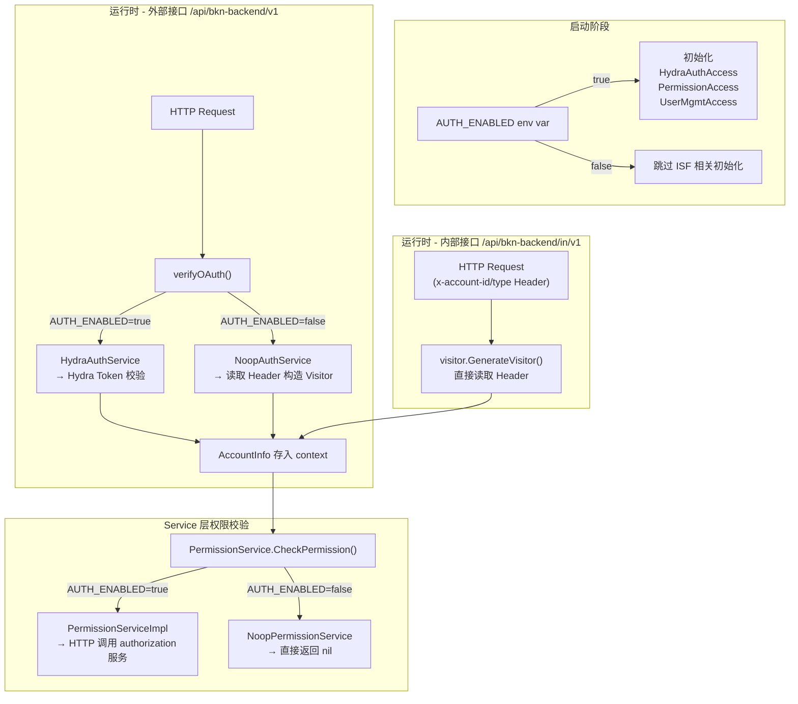
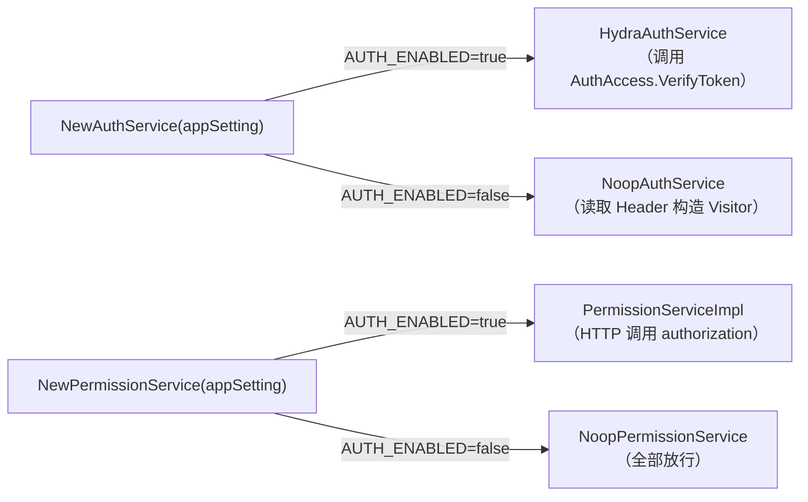
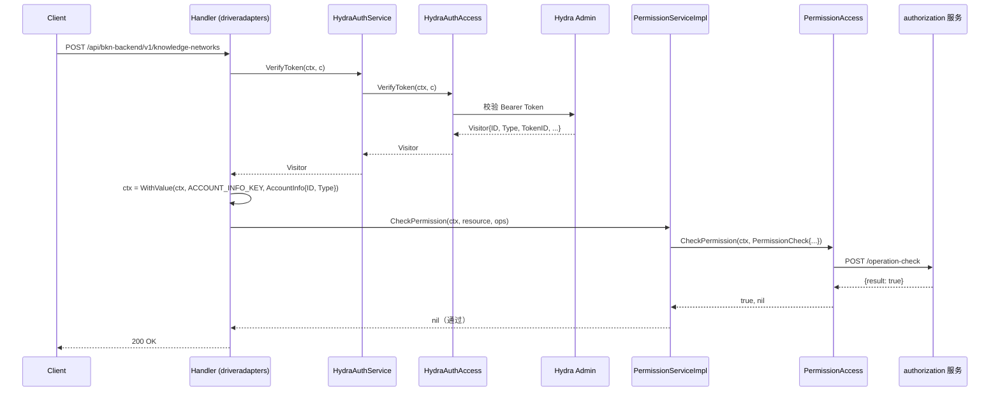
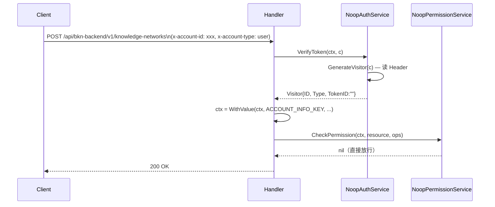

# bkn-backend 认证开关（AUTH_ENABLED）技术设计文档

> **状态**：已通过
> **负责人**：@Ken.li
> **日期**：2026-03-20
> **相关 Ticket**：[#177](https://github.com/kweaver-ai/adp/issues/177)

---

## 1. 背景与目标 (Context & Goals)

### 背景

bkn-backend 原先在任何部署环境下都强依赖 ISF（Internal Security Framework，即 Hydra OAuth2 服务 + authorization 权限服务 + user-management 用户管理服务）。在以下场景中，这个强依赖导致了明显痛点：

- **本地开发 / 单元测试**：开发人员需要在本地启动完整的 ISF 栈才能跑通服务，环境搭建成本高
- **私有化部署（非 ISF 环境）**：部分客户部署不包含 ISF 组件，服务无法独立运行
- **集成测试**：CI 环境缺少 Hydra 实例时，外部接口全部 401，测试无法进行

### 目标

1. 引入 `AUTH_ENABLED` 环境变量，作为认证授权功能的全局开关
2. 开关关闭时，服务能够零依赖 ISF 独立运行，所有请求视为已认证
3. 开关默认为 `true`，保持生产环境安全优先的原则不变

### 非目标 (Non-Goals)

- 不引入细粒度的认证/授权独立开关（认证与授权始终同步开启/关闭）
- 不提供运行时动态切换（需重启服务生效）
- 不改变 Hydra / authorization 服务本身的任何逻辑

---

## 2. 方案概览 (High-Level Design)

### 2.1 系统架构图



---

## 3. 详细设计 (Detailed Design)

### 3.1 核心逻辑 (Core Logic)

#### 开关读取

```go
// common/setting.go
func GetAuthEnabled() bool {
    envVal := os.Getenv("AUTH_ENABLED")
    // 仅当显式设置为 false 或 0 时禁用
    return envVal != "false" && envVal != "0"
}
```

默认行为（不设置 `AUTH_ENABLED`）等同于 `true`，安全优先。

#### 启动时条件初始化（main.go）

```go
if common.GetAuthEnabled() {
    logics.SetAuthAccess(auth.NewHydraAuthAccess(appSetting))
    logics.SetPermissionAccess(permission.NewPermissionAccess(appSetting))
    logics.SetUserMgmtAccess(user_mgmt.NewUserMgmtAccess(appSetting))
}
// 其余 Access 无需认证，无条件初始化
```

Auth/Permission/UserMgmt 三个 Access 仅在 `AUTH_ENABLED=true` 时注册；`false` 时对应的全局变量保持 `nil`。

#### Service 工厂方法（双路由）



两个工厂均使用 `sync.Once` 保证单例，全生命周期只初始化一次。

#### 请求处理时序（AUTH_ENABLED=true）



#### 请求处理时序（AUTH_ENABLED=false）



### 3.2 数据模型变更 (Data Schema)

本特性不涉及数据库 Schema 变更。

### 3.3 接口定义 (Interface Definition)

#### 新增接口与实现

| 接口/类 | 文件 | 说明 |
|---------|------|------|
| `NoopAuthService` | `logics/auth/noop_auth_service.go` | AUTH_ENABLED=false 时的认证空实现 |
| `NoopPermissionService` | `logics/permission/noop_permission_service.go` | AUTH_ENABLED=false 时的权限空实现 |
| `visitor.GenerateVisitor()` | `common/visitor/visitor.go` | 从 HTTP Header 构造 Visitor（内部接口/Noop 模式共用） |

#### Helm 新增环境变量注入

```yaml
# helm/bkn-backend/values.yaml
auth:
  enabled: true   # 默认开启认证

# helm/bkn-backend/templates/deployment.yaml
- name: AUTH_ENABLED
  value: {{ .Values.auth.enabled | quote }}
```

#### NoopPermissionService.FilterResources 特殊行为

```go
// AUTH_ENABLED=false 时，原样返回所有资源并赋予 fullOps 全量权限
func (n *NoopPermissionService) FilterResources(..., fullOps []string) (map[string]ResourceOps, error) {
    result := make(map[string]ResourceOps)
    for _, id := range ids {
        result[id] = ResourceOps{ResourceID: id, Operations: fullOps}
    }
    return result, nil
}
```

---

## 4. 边界情况与风险 (Edge Cases & Risks)

**AUTH_ENABLED=false 时，外部接口（`/v1`）的账户身份来自 Header**

NoopAuthService 通过 `GenerateVisitor(c)` 从 `x-account-id` / `x-account-type` Header 读取账户信息。业务逻辑不存在对 `accountInfo.ID` 的强依赖，无数据归属问题。

**AUTH_ENABLED 仅在首次部署时设置，后续不可更改**

`sync.Once` 保证工厂方法全生命周期只执行一次。`AUTH_ENABLED` 视为部署时的不可变配置，后续变更需重新部署，后果由部署方自行负责。

**禁止绕过工厂方法直接调用 Access 层**

`AUTH_ENABLED=false` 时，`logics.AA/PA/UA` 为 `nil`。架构约束：所有业务逻辑必须通过 Service 工厂方法访问，禁止直接引用 Access 变量，违反此约束将导致 nil dereference panic。

